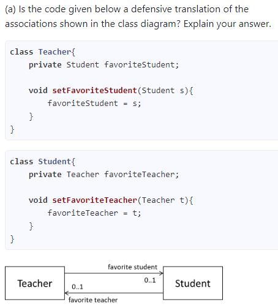
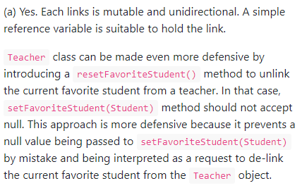

# CS2103 Notes (Week 10)

# Lecture (Week 9 - 18/10)

* Law of Demeter
    - Can still call methods of a parameter
    - It's **okay** to create and do stuff to new objects
        - ** It's okay if `new` is not within in the code
        - As long as it is a new object, not objects that have existed already
    - Heavily hinted that could be in the exam paper
* 4 techniques
    1. Misunderstandings
        - Different interpretations
        - Internal/Developer screwed up
        - **Use assertions to abort**
    2. Mishaps
        - User does not do the right things
        - Safety mechanisms
        - **Use exceptions to handle**
        - E.g. API calls Google server but server down
    3. Mysteries
        - **Use logging**
    4. Misuse
        - **Write defensive code**
        - Actively try to block things
        - Identify holes, actively plug them
        - Make sure it never functions incorrectly
* Types of patterns in SE domain
    1. Singleton
        - Context: One and only one object, shared among others
        - Problem: how to avoid multiple objects
        - Solution: 
            - make the constructor private
            - declare variable of the same time
            - static public method to create object if not yet exist
        - Not so good pattern
    2. Facade
        - Context: component with many internal structures, 
        - Problem: Don't want clients to access them directly
        - Solution: put a class that deals with these
            - E.g. `LogicManager`
        - `<<facade>>`,  `<<client>>`, `<<interface>>`, `<<singleton>>`: roles played by the class (don't know actual name)
    3. Command
* Writing test cases
    - How much information to reveal
        - Glass/white-box: look at code, write tests to test all the branches
        - Gray-box: some information is used
            - Design test cases of different conditions
            - E.g. different algo when more than 1000 objects
        - Black-box
    - Cost
        - There is a cost to testing
        - Effectiveness and efficiency of test (E&E)
            - Effective: find more bugs
            - Efficient: use less test cases
        - A test case should have a reasonable change of finding a new bug not found by the other test cases
    - Equivalence partitioning
        - More than 1 partition can produce the same output
        - E.g. within range, outside range
        - Not necessary to test many cases from one partition
            - increases efficiency
        - Cover all partitions
            - increases effectiveness
    - Boundary value analysis
        - Testing at the boundary (minimally), just outside, just inside
        - Depends on how many test cases you can afford
        - Not applicable for cases when values are not continuous
            - E.g. Prime and not prime numbers
        - Improves E&E
            - Cut down redundant test cases
            - Focus on areas where there are likely to be more bugs

-----

# Design Patterns

* An _elegant reusable **solution**_ to a _commonly recurring **problem_** within _given **context**_ in software design
* Definition: elegant solution to recurring problems in software design
* Examples of recurring design problems

| Design Context | Recurring Problem |
| --- | --- |
| Assembling a system that makes use of other existing systems implemented using different technologies | What is the best architecture? |
| UI needs to be updated when data in application backend changes | How to initiate an update to UI when data changes without coupling backend to UI? |

* Solutions (i.e. design patterns) that are refined over time
* Term popularised by seminal book _Design Patterns: Elements of Reusable Object-Oriental Software_ by _"Gang of Four"_
* Format to describe a pattern:
    1. **Context**: Situation or scenario where design problem encountered
    2. **Problem**: Main difficulty to be resolved
    3. **Solution**: Core of solution
        - Only most general details
        - May need further refinement for a specific context
    4. **Anti-patterns** (_optional_)
        - Commonly used solutions
        - Usually incorrect and/or inferior to Design Pattern
    5. **Consequence** (_optional_)
        - Identify pros and cons of applying pattern
    6. **Other useful information** (_optional_)
        - Code examples
        - Known uses
        - Other related patterns etc

## 1. Singleton pattern

* Explain Singleton design pattern
* When we want a class with no more than one instance
* `private` constructor

| Component | Description |
| --- | --- |
| **Context** | Certain classes that should not have more than one instance (single instances aka _singletons_) |
| **Problem** | Can instantiate normal class multiple times by invoking constructor |
| **Solution** | Make constructor of singleton class `private` (because `public` constructor will allow others to instantiate class at will) |
| | Provide `public` class-level method to access _single instance_ |

* Implementation
<!-- -->
    class Logic {
        private static Logic theOne = null;

        // Private constructor, prevent instantiation outside class
        private Logic() {
            ...
        }

        // Once single copy created, subsequent calls returns single instance of class
        public static Logic getInstance() {
            if (theOne == null) {
                theOne = new Logic();
            }
            return theOne;
        }
    }

* If not Singleton class, create an object with
    - `Logic m = new Logic();`
* Singleton class, assess object with
    - `Logic m = Logic.getInstance();`
* Pros
    - Easy to apply
    - Effective in achieving goal with minimal extra work
    - Easy way to access singleton object from anywhere in code base
* Cons
    - Singleton object acts like global variable, increases coupling across code base
    - In testing, difficult to replace Singleton object with stubs (static methods cannot be override)
    - In testing, singleton objects carry data from one test to another even when we want each test to be independent from others
* Recommended to apply Singleton pattern when
    - Requiring only one instance of a class
    - There is a _real risk_ of creating multiple objects by mistake
    - Creating such multiple objects has real negative consequence

## 2. Facade pattern

* Components need to access functionality deep inside other components

| Component | Description |
| --- | --- |
| **Problem** | Access to component should be allowed without exposing its internal details |
| | e.g. `UI` component should access functionality of `Logic` component without knowing it contained a `Book` class within it |
| **Solution** | Include in a Facade (_front of the building_) that sits between component internals and users of the component |
| | Such that all access to the component happens through Facade class |

## 3. Command pattern

| Component | Description |
| --- | --- |
| **Context** | System required to execute a number of commands, each doing a different task |
| | E.g. System have to support `Sort`, `List`, `Reset` commands |
| **Problem** | Preferable that some part of the code executes these commands without having to know each command type |
| | E.g. `CommandQueue` queues and execute commands without knowing what each command does |
| **Solution** | Essential element of pattern is to have a general `<<Command>>` object that can be passed around, stored, executed, etc without knowing type of command (i.e. via **polymorphism**) |

## 4. Abstraction Occurrence pattern

* 'Occurrences', many common attributes but some attributes are different

| Component | Description |
| --- | --- |
| **Context** | Group of similar entities that appears to be 'occurrences'/'copies' of the same thing, sharing lots of common information, but also differing in significant ways |
| | E.g. `Book` in library, got same author title etc but different barcode, purchase date |
| | E.g. Episode of the same TV series |
| | E.g. Stock items of the same product model |
| **Problem** | Not good to represent objects mentioned as a single class, will result in duplication of data which can lead to inconsistencies in data (if some duplicates not updated consistently) |
| | Solution requires common information to be duplicated by all instances |
| **Anti-pattern** |  |
| | Segregate common and unique information into class hierarchy. Each book title is represented by a separate class with common data (i.e. Name, Author, ISBN) hard-coded in the class itself |
| | This solution is problematic because each book title is represented as a class, resulting in thousands of classes (one for each title). Every time the library buys new books, the source code of the system will have to be updated with new classes. |
| **Solution** | Represent copy of an entity (i.e. copy of a book) with 2 objects instead of one |
| | Separate common and unique information into 2 classes to avoid duplication |
| | General solution:  |
| | `<<Abstraction>>` should hold all common information, `<<Occurrence>>` should keep unique information |
| | `<<Roles>>` played by each class |
| | Diagram as _meta-model_ (i.e. model of a model) of class diagram |

* One of the key things to keep in mind is that the `<<Abstraction>>` does not represent a real entity. 
    - Represents some information common to a set of objects
    - A single real entity is represented by an object of `<<Abstraction>>` type and `<<Occurrence>>` type
* Before applying the pattern, some attributes have the same values for multiple objects
    - E.g. w.r.t. the `BookTitle-BookCopy` example given in this handout, values of attributes such as `book_title`, `ISBN` are exactly the same for copies of the same book
* After applying the pattern, the `Abstraction` and the `Occurrence` classes together represent one entity. It is like one class has been split into two. For example, a `BookTitle` object and a `BookCopy` object combines to represent an actual `Book`.

# Defensive Programming

* Defensive programmer, code under assumption "if we leave room for things to fo wrong, they _will_ go wrong"
    - Proactively try to eliminate any room for things to go wrong
* Example:
    - Method `MainApp#getConfig()` returns a `Config` object containing configuration data
    - If returned Config object not meant to be modified, defensive programmer might use more _defensive_ implementation
        - More defensive because even if returned `Config` object modified (although not meant to be), `config` object inside `MainApp` object will not be affected
<!-- -->

    class MainApp{
        Config config;

        /** Normal implementation: Returns the config object */
        Config getConfig(){
            return config;
        }

        /** Defensive implementation */
        Config getConfig(){
            return config.copy(); //return a defensive copy
        }
    }

* Not necessary to be 100% defensive all the time
* Pros
    - Less prone to misuse
* Cons
    - Code more complicated and slower to run
* Suitable degree of defensiveness depends on many factors like:
    - _How critical is the system?_
    - _Will the code be used by programmers other than the author?_
    - _The level of programming language support for defensive programming_
    - _The overhead of being defensive_
* Summary
    - Defensive programming requires a more checks, possibly making the code longer, more complex, and possibly slower
    - Use it only when benefits outweigh costs, which is often

1. **Enforcing Compulsory Associations**

* Can use defensive coding to enforce compulsory associations
* Example:
    - 2 classes, `Account` and `Guarantor` with an association

    

    - Compulsory association (i.e. an `Account` object should always be linked to a `Guarantor`)
    - Normal way of coding (using reference variable)
<!-- -->
    class Account {
        Guarantor guarantor;

        void setGuarantor(Guarantor g) {
            guarantor = g;
        }
    }

* Possible misuse
    - Results in an `Account` without a `Guarantor`
    - Real consequence in a real banking system
<!-- -->
    Account a = new Account();
    a.setGuarantor(null);
* Possible solution
    - Make code more defensive
    - Proactively enforcing multiplicity constraint
<!-- -->
    class Account {
        private Guarantor guarantor;

        public Account(Guarantor g){
            if (g == null) {
                stopSystemWithMessage("multiplicity violated. Null  Guarantor");
            }
            guarantor = g;
        }

        public void setGuarantor (Guarantor g){
            if (g == null) {
                stopSystemWithMessage("multiplicity violated. Null  Guarantor");
            }
            guarantor = g;
        }
        …
    }
* Example
    - `Marriage` class handle setting/removal of reference
    - Same man and woman should be married to each other and not others

    

<!-- -->
    public class Marriage {
        private Man husband = null;
        private Woman wife = null;

        // extra information like date etc can be added

        public Marriage(Man m, Woman w) throws Exception {
            if (m == null || w == null) {
                throw new Exception("no man/woman");
            }
            if (m.isMarried() || w.isMarried()) {
                throw new Exception("already married");
            }
            husband = m;
            m.enterMarriage(this);
            wife = w;
            w.enterMarriage(this);
        }

        public Man getHusband() throws Exception {
            if(husband == null) {
                throw new Exception("error state");
            } else {
                return husband;
            }
        }

        public Woman getWife() throws Exception {
            if(wife == null) {
                throw new Exception("error state");
            } else {
                return wife;
            }
        }

        // removal of both ends of 'Marriage'
        public void divorce() throws Exception {
            if (husband==null || wife==null) {
                throw new Exception("no marriage");
            }
            husband.removeFromMarriage(this);
            husband = null;
            wife.removeFromMarriage(this);
            wife = null;
        }
    } 
* If immutable variable (i.e. once association formed, cannot be changed)
    - Do not be `public`
    - Should not have a `set` method
    - Have constructor check for `null` input
* **Always check if code allows for `null` objects to be passed to `set` methods! (Especially if association is at least one)**

2. **Enforcing 1-to-1 Associations**

* Example: `MineCell` cannot exist without a `Mine` and vice versa, which requires simultaneous object creation

* But Java can only create one object at a time
* 2 alternative implementations (violate multiplicity for a short period of time)
* Option 1:
    - Forces `Mine` to be without a `MinedCell` until `MinedCell created
<!-- -->
    class MinedCell {
        private Mine mine;

        public MinedCell(Mine m){
            if (m == null) {
                showError();
            }
            mine = m;
        }
        …
    }
* Option 2:
    - More defensive because `Mine` immediately linked to `MinedCell`
<!-- -->
    class MinedCell {
        private Mine mine;

        public MinedCell(){
            mine = new Mine();
        }
        …
    }

3. **Enforcing Referential Integrity**
    - Use defensive coding to enforce referential integrity of bi-directional associations
        - 2 objects required to link to each other
    - If not implemented properly, can result in referential integrity violations
        - When one of these links is not consistent with the other
    - Bidirectional association (in _figure (a)_)
    - Usually emulated at code level using 2 variables (in _figure (b)_)

    

    - **Bad** example:
<!-- -->
    class Man {
        Woman girlfriend;

        void setGirlfriend(Woman w) {
            girlfriend = w;
        }
        …
    }

    class Woman {
        Man boyfriend;

        void setBoyfriend(Man m) {
            boyfriend = m;
        }
    }

    // Expected Usage
    Woman jean;
    Man james;
    …
    james.setGirlfriend(jean);
    jean.setBoyfriend(james);

    // Abused usage
    Woman jean; Man james, yong;
    …
    james.setGirlfriend(jean);  
    jean.setBoyfriend(yong); 

* Now James' girlfriend is Jean, while Jean's boyfriend is not James. This situation results as the code was not defensive enough to stop this "love triangle".

* **_Referential integrity has been violated_**
    - **_Inconsistency in object reference_**
* Solution
    - Implement 2 classes as shown below
    - When code `james.setGirlfriend(jean)` is executed, code ensures `james` breaks up with any current girlfriend before he accepts `jean` as girlfriend
    - Also ensures `jean` breaks up with any existing boyfriends and accepts `james` as the boyfriend
<!-- -->
    public class Woman {
        private Man boyfriend;

        public void setBoyfriend(Man m) {
            if(boyfriend == m){
                return;
            }
            if (boyfriend != null) {
                boyfriend.breakUp();
            }
            boyfriend = m;
            m.setGirlfriend(this);
        }

        public void breakUp() {
            boyfriend = null;
        }   
        ...
    }

    public class Woman {
        private Man boyfriend;

        public void setBoyfriend(Man m) {
            if(boyfriend == m){
                return;
            }
            if (boyfriend != null) {
                boyfriend.breakUp();
            }
            boyfriend = m;
            m.setGirlfriend(this);
        }

        public void breakUp() {
            boyfriend = null;
        }   
        ...
    }

-----

| Question | Solution |
| --- | --- |
|  |  |
|  |  |
|  | _Refer below_ |

<!-- -->
    void removeMember(Member m) {
        if (m==null) {
            throw exception("this is null, not a member!");
        } else if(member_count == 10) {
            throw exception("we need at least 10 members to survive!");
        } else if(!isMember(m)) {
            throw exception ("this fellow is not a member of our club!");
        } else {
            members.remove(m); // members is a data structure such as ArrayList
        }
    }

-----

# Design by Contract (DbC)

* Approach for designing software/components that requires defining interface specifications for software components
    - Formal, precise and verifiable
* Assumes that caller has responsibility to ensure all preconditions are met
* Operation will honor contract only if preconditions have been met
    - If any not met, behaviour of operation is "unspecified"
* Example:
    - Operation implemented with behaviour specified in API
        - Preconditions, post conditions, exceptions etc
    - _vs Defensive approach_
        - Code should first check if preconditions have been met
        - If violated, throw exceptions
* Languages
    - _Eiffel_
        - Native support for DbC
        - Preconditions of an operations can be specified in _Eiffel_
        - Language will check precondition violations without need to be it explicitly in code
    - _Java_, _C++_
        - No build-in _DbC_ support, assertions can be used to confirm pre-conditions
        
# Test Case Design: Intro

* Need for deliberate test case design
    - Not practical for _exhaustive testing_ (testing for all possible cases)
    - Often requires a massive/infinite number of test cases
    - Many variations
        - E.g. add to empty list, list with one item, list with _n_ items
        - E.g. add to _English_, _French_, _Spanish_ etc word to list
        - E.g. Add item that is existing in list
        - E.g. add item immediately after adding another item, after system startup 
    - Except for trivial SUTs
* Program testing can be used to show the presence of bugs but never their absence (Dijkstra)
* Every test case adds to the cost of testing
    - E.g. expensive in cases like on-field testing of flight-control software
* Test cases need to be design to make the use of testing resources
* Testing should be _E&E_:
    1. **_Effective_**
        - Finds high pct of existing bugs/number of defects
    2. **_Efficient_**
        - Has a high rate of success (bugs found/test cases)/uses less test cases
* Benefits of _E&E_:
    - Improve quality of SUT
    - Save money
    - Save time spent on test execution
    - Save effort on writing and maintaining tests
    - Minimise redundant test cases
    - Forces us to understand SUT better
- Each new test added should target a potential fault that is not already targeted by existing test cases

* Positive _vs_ Negative Test Cases

| Type | Description |
| --- | --- |
| **Positive test case** | Test is designed to produce an expected/valid behaviour |
| **Negative test case** | Test designed to produce a behaviour that indicates an invalid/unexpected situation (e.g. error message) |

* Black _vs_ Gray _vs_ White-boxes

| Approach | Description|
| --- | --- |
| **Black-box** | AKA _specification-based_/_responsibility-based_ |
| | test cases designed exclusively based on SUT's specified external behaviour |
| **White-box** | AKA _glass-box_/_structured/implementation-based_ |
| | Test cases designed based on what is known about the SUT's implementation (i.e. the code) |
| **Gray-box** | Test case design uses _some_ important info about implementation |
| | E.g. If implementation of a sort operation uses different algorithms to sort lists shorter than 10000 items and lists longer than 10000 items, more meaningful test cases can be added to verify correctness of both algorithms |

* Testing based on Use Cases
    - Use cases used for system testing, acceptance testing
    - E.g. main success scenario one test case, each variation (due to extension) another test case
    - Note: use cases do not specify the exact data entered into system
        - Tester has to choose data by considering equivalence partitions, boundary values
        - Combinations of these, result in one use case forming many test cases
    - Increase _E&E_ of testing
        - Give more attention to high-priority use cases
        - E.g. Scripted approach (i.e. _scripted testing vs exploratory testing_) can be used to test high priority test cases
        - E.g. Exploratory approach used to test other areas of concern that could emerge during testing
    
# Test Case Design: Equivalence Partitioning (EP)

* **Definition:** Equivalence partition/equivalence class
    - A group of test inputs that are likely to be processed by the SUT in the same way
* In general, most SUTs do not treat each input in a unique way
    - They process all possible inputs in a small number of distinct ways
    - A range of inputs is treated the same way inside a SUT
        - i.e. groups of inputs treated the same way
* _Equivalence partitioning (EP)_ is a test case design
technique that uses above observation to improve _E&E_ testing
* Benefit of dividing possible inputs into equivalence partitions
    1. Avoid testing too many inputs from one partition
        - Unlikely to find new bugs by testing too many inputs from same partition
        - Increases _efficiency_ of testing, reduce redundant test cases
    2. Ensure all partitions are tested
        - Prevent bugs going unnoticed from missing partitions
        - Increases _effectiveness_ of testing, increase chance of finding bugs
* Derive _EPs_ from specifications of SUT*
    - E.g. `isValidMonth` has partitions of `[MIN_INT...0]`(_false_), `[1...12]`(_true_), `[13...MAX_INT]`(_false_)
* When SUT has multiple inputs, should identify EPs, for each input
    - E.g. For method `duplicate(String s, int n): String` which returns a `String` that contains `s` repeated `n` times
        - Example EPs for `s`: zero-length strings, string containing whitespaces etc
        - Example EPs for `n`: `0`, negative values etc
* An EP may not have adjacent values
    - E.g. prime numbers
* Cases when have to consider **each value as a partition by itself**
    - When inputs have only a small number of possible values
    - Each value has a potentially unique behaviour
    - E.g. `showStatusMessage(GameStatus s): String` returns a unique `String` for each possible value of `s` where `GameStatus` is an `enum`
* **Note:** EP technique is merely a heuristic, not an exact science
    - Especially when applied manually (_vs_ automated program analysis tools to derive EPs)
    - Partitions depends on how one 'speculates' the SUT to behave internally
    - Yield better and more precise EPs by combining with _glass-box_/_gray-box_ approach
* Example: `squareRoot(String s): int`
    - Pre-conditions: `s` represents a positive integer
    - Returns the square root of `s` if the square root is an integer, returns `0` otherwise
    - EPs:
        - `[s is not a valid number]`
        - `[s is a negative integer]`
        - `[s has an integer square root]`
        - `[s does not have an integer square root]`
* Identify EPs of all data participants that can potentially influence the behaviour of the method, examples:
    - Target object of method call
        - Object that is modified, used (especially when no params)
    - Associated objects involved in the method
        - Applicable only for glass-box/grey-box method
    - Input parameters of method call
    - Other data/objects accessed by the method (e.g. global variable)
        - May not be applicable if using black-box approach
        - Test case designer will not know how method is implemented
    - EPs formed from combinations of EPs of params
* Questions to ask:
    - _Will this method behave differently for different objects (class of object that is involved)?_
    - _If yes, how will it differ?_

# Test Case Design: Boundary Value Analysis (BVA)

* BVA is a test case design heuristic based on the observation that bugs often result from incorrect handling of boundaries of equivalence partitions
* Ends of points of boundaries often used in branching instructions
    - More likely to cause errors
* When picking test inputs from equivalence partition, values near boundaries (i.e. boundary values) are more likely to find bugs
    - Sometimes also called _Corner cases_
* Typically, choose 3 values around boundary to test
    1. One value from boundary
    2. One value just below boundary
    3. One value just above boundary
    - Number of values to pick depends on other factors (e.g cost of each test case)
* Examples:

| Equivalence partition | Some possible boundary values |
| --- | --- |
| `[1-12]` | `0,1,2`,`11,12,13` |
| `[MIN_INT, 0]` where `MIN_INT` is the minimum possible integer value allowed by the environment | `MIN_INT`, `MIN_INT+1`, `-1`, `0` , `1` |
| `[any non-null String]` | `Empty String`, `a String of maximum possible length` |
| `[prime numbers]` | `No specific boundary` |
| `[“F”]` | `No specific boundary` |
| `[“A”, “D”, “X”]` | `No specific boundary` |
| `[non-empty Stack]` (assume fixed size stack) | Stack with `1 element`, `2 elements`, `no empty space`, `only 1 empty space` |