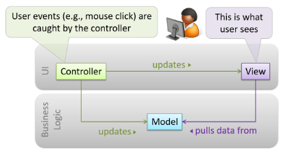
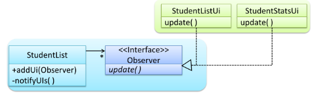
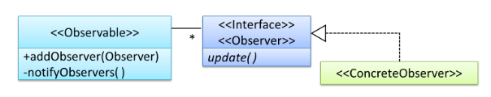

# CS2103 Notes (Week 11)

## Week 10 (Lecture - 25/10)

* Design pattern: observer pattern
    - **D** in **SOLID**: Dependency Inversion Principle
    - Reverse the dependency
    - E.g. _addListener()_
        - When this changes, call this function
    - E.g. _handleExit_
* Don't try to force patterns
* Facade pattern is supposed to reduce coupling
-----
* Architectural patterns
    - Design by architects
    - Patterns, but for architects
    - Different styles
        - Can be mixed
    1. n-tier
    2. transaction processing
        - dispatchers
        - E.g. bank (ATM, bank tellers) send transaction details so they can be processed one by one
    3. event-driven
        - Listeners
    4. client-server
        - GUI
        - E.g. web applications
            - Clicks on something, many events occur, other components listening for click event
* Many different possibilities for test cases
    - Test every possible value at least one
    - E.g. Minimally 3 times (each row, cheapest strategy)
    - E.g. Case 2, not sure if `male` and `slow` works because `medium` is the one definitely causing the error
    - **All valid inputs must appear at least once in a positive test case**
    - **No more than 1 invalid input in a test case**
    - Low probability (risk than can be taken) that combination of all valid gives a valid
        - Rare that individually they are invalid but combination/pairs of inputs cause a valid output
* Quality Assurance
    - Both are important
        - Especially validation because buggy code can be fixed
    - Validation: _Are we building the correct product?_
        - Buggy requirements
    - Verification: _Are we building the product correctly?_
        - Buggy code
* Testing can _never_ prove the absence of bugs but can prove the presence of bugs
* Formal methods
    - Mathematically analysing
    - Prove that something works definitely
    - But takes so much resources (time, money) for something simple
    - But important for software that are extremely crucial
        - E.g. airplane, nuclear software
        - Worth it
* Dynamic Analysis
    - Run the code then can find out what's going on
-----
* Reuse
    - Framework; something like a big part of an application which you can modify to your needs
    - Framework has the control, decided when to call your code
        - _Inversion of control_
        - Opposite of using libraries: _you_ call the code
* Deciding characteristic is runtime environment
* Enterprise application platforms
    - Not installed in your computer
    - Need to do many additional things
        - Security, connection
        - Load balancing
        - But common to many enterprise applications
* Library, framework, platform
* JUnit
    - Both a library and framework
    - Has API to call
    - Running by JUnit, just fill in test cases

-----

# Week 11 Topics

# Design Patterns (more)

* Other design patterns
    - MVC pattern
    - Observer pattern
    - Others
* Most famous source of design pattern (_Gang of Four_ book)
    - 23 design patterns divided into 3 categories
    1. **Creational**
        - About object creation
        - Separate operation of an application from how its objects are created
        - _Abstract Factory, Builder, Factory Method, Prototype, Singleton_
    2. **Structural**
        - About composition of objects into larger structures while catering for future extension in structure
        - _Adapter, Bridge, Composite, Decorator, Facade, Flyweight, Proxy_
    3. **Behavioral**
        - Defining how objects interact
        - Define how responsibility is distributed among them
        - _Chain of Responsibility, Command, Interpreter, Template Method, Iterator, Memento, Observer, State, Strategy, Visitor_

## Model View Controller (MVC) Pattern

* **Context**: Most applications support storage/retrieval of information, displaying of info to user (often via multiple UIs having different formats), and changing stored information based on external inputs
* **Problem**: High coupling can result from interlinked nature of features described above
* **Solution**: Decouple data, presentation, and control logic of an application by separating them into 3 different components
    1. _Model_
        - Stores and maintains data
        - Update views if necessary
    2. _View_
        - Display data
        - Interacts with user
        - Pulls data from model if necessary
    3. _Controller_
        - Detects UI events (e.g. mouse clicks, button pushes)
        - Takes follow up action
        - Update/changes model/view when necessary
* Diagram of relationships between components
    - Usually, UI = _view_ + _controller_

* Note:
    - In a simple UI, only one _view_; can combine _controller_ and _view_ as one class
    - Many variations of MVC model used in different domains
        - E.g. different for desktop GUI and Web application
* Example:
    - MVC in student management system
    - Scenario: user retrieving data of one student
    - Flow:
        - User clicks on button using the UI
        - 'Click' event caught and handled by `UiController`
    - `ref` frame indicates interactions within that frame extracted out to another separate sequence diagram

## Observer Pattern

* **Context**: An object or many objects is/are interested to get notified when a change happens to another object
    - Some objects want to 'observe' another object
* **Problem**: The 'observed' object should not be coupled to objects that are 'observing' it
* **Solution**: Force the communication through an interface known to both parties

* **Generic description of observer pattern**
    - `<<Observer>>`: an interface
        - Any class that implements it can observe an `<<Observable>>`
        - Any number of `<<Observer>>` objects can observe/listen to changes of `<<Observable>>`
    - `<<Observable>>` maintains list of `<<Observer>>` objects
        - `addObserver(Observer)` operation adds a new `<<Observer>>` to the list
    - Whenever there is a change in `<<Observable>>`
        - `notifyObservers()` operation is called
        - will call the `update()` operation of all `<<Observer>>` in the list

    

* UI frameworks (like JavaFX) has inbuilt support for Observer pattern
* Polymorphism in Observer pattern
    - All `Observable` objects invoke the `notifyObservers()` method, treat all `Observer` objects as a general type
    - Although `update()` method of `Observer` could potentially show different behaviour based on its actual type
* In short, Observer pattern can be used when we want one object to initiate an activity in another object without having a direct dependency from the first object to the second object
* Example:
<!-- -->
    // Constructed during initialisation of system

    // FIRST
    // Create relevant objects
    StudentList studentList = new StudentList();
    StudentListUi listUi = new StudentListUi();
    StudentStatusUi statusUi = new StudentStatsUi();

    // SECOND
    // 2 UIs indicate to StudentList that they are interested in being updated whenever StudentList changes (i.e. 'subscribing for updates') 
    studentList.addUi(listUi);
    studentList.addUi(statusUi);

    // THIRD
    // Within addUi operation of StudentList, all Observer objects subscribers are added to an internal data structure called observerList
    //StudentList class
    public void addUi(Observer o) {
        observerList.add(o);
    }

    // Whenever data in StudentList changes (i.e. new student added to list)

    // FIRST
    // All interested observers are updated by calling notifyUIs operation
    //StudentList class
    public void notifyUIs() {
        //for each observer in the list
        for(Observer o: observerList){
            o.update();
        }
    }

    // SECOND
    // UI can pull data from StudentList whenever update operation called
    //StudentListUI class
    public void update() {
        //refresh UI by pulling data from StudentList
    }

## Combining Design Patterns

* Multiple patterns can be combined to fit a pattern
* Design patterns are usually embedded in a larger design
* Sometimes applied in combination with other desgin patterns

-----

| Design Patterns | Design Principles |
| --- | --- |
| | Have varying degrees of formality (rules, opinions, rules of thumb, observations, axioms) |
| | More general |
| | Wider applicability |
| | Greater overlap of applicability |

Pros and cons of design patterns:
* Provides high-level vocab to talk about design
    - _'apply Observer pattern here'_
* Knowing more patterns a way to be more 'experienced'
    - Learn at least the **context** and problem of patterns
* Some patterns are
    - **domain-specific**: e.g. patterns for distributed applications
    - **created in-house**: e.g. patterns in company/project
    - **self-created**: e.g. from past experience
* Be careful not to overuse patterns
    - Do not throw patterns at a problem at every opportunity
    - Patterns come with overhead
        - e.g. add more classes, increase level of abstraction
    - Use only when they are needed
* Before applying pattern, make sure that:
    - There is substantial improvement in design, not just superficial
    - Carefully consider associated tradeoffs (sometimes a design pattern is not appropriate/overkill)

* Patterns exist beyond software design domain
    - _Christopher Alexander_: notion of capturing design ideas as "patterns"
        - Building architect noted for theories about design
        - Book _Timeless way of building_: "design patterns" for constructing buildings
    - Sample from _Timeless way of building_
    > When a room has a window with a view, the window becomes a focal point: people are attracted to the window and want to look through it. The furniture in the room creates a second focal point: everyone is attracted toward whatever point the furniture aims them at (usually the center of the room or a TV). This makes people feel uncomfortable. They want to look out the window, and toward the other focus at the same time. If you rearrange the furniture, so that its focal point becomes the window, then everyone will suddenly notice that the room is much more “comfortable”
    - Patterns and anti-patterns are general concepts applicable to any domain, not just software design
    - Domains
        - E.g. building architecture
        - E.g. software engineering (general types of patterns: analysis patterns, design patterns, testing patterns, architectural patterns, project management patterns etc)
    - **Abstraction occurrence** pattern is more of analysis pattern than design pattern
    - MVC more of architectural pattern
    - New patterns can be created
        - Common problems that need to be solved frequently leads to a non-obvious and better solution
        - Can be formulated as a pattern so can be reused by others
    - Don't reinvent the wheel, pattern might already exist

# Architectural Styles

# Test Cases: Combining Multiple Inputs

# Other QA Techniques

# Reuse

# Cloud Computing

# Other UML Models