# CS2103 Notes (Week 11)

## Week 10 (Lecture - 25/10)

* Design pattern: observer pattern
    - **D** in **SOLID**: Dependency Inversion Principle
    - Reverse the dependency
    - E.g. _addListener()_
        - When this changes, call this function
    - E.g. _handleExit_
* Don't try to force patterns
* Facade pattern is supposed to reduce coupling
-----
* Architectural patterns
    - Design by architects
    - Patterns, but for architects
    - Different styles
        - Can be mixed
    1. n-tier
    2. transaction processing
        - dispatchers
        - E.g. bank (ATM, bank tellers) send transaction details so they can be processed one by one
    3. event-driven
        - Listeners
    4. client-server
        - GUI
        - E.g. web applications
            - Clicks on something, many events occur, other components listening for click event
* Many different possibilities for test cases
    - Test every possible value at least one
    - E.g. Minimally 3 times (each row, cheapest strategy)
    - E.g. Case 2, not sure if `male` and `slow` works because `medium` is the one definitely causing the error
    - **All valid inputs must appear at least once in a positive test case**
    - **No more than 1 invalid input in a test case**
    - Low probability (risk than can be taken) that combination of all valid gives a valid
        - Rare that individually they are invalid but combination/pairs of inputs cause a valid output
* Quality Assurance
    - Both are important
        - Especially validation because buggy code can be fixed
    - Validation: _Are we building the correct product?_
        - Buggy requirements
    - Verification: _Are we building the product correctly?_
        - Buggy code
* Testing can _never_ prove the absence of bugs but can prove the presence of bugs
* Formal methods
    - Mathematically analysing
    - Prove that something works definitely
    - But takes so much resources (time, money) for something simple
    - But important for software that are extremely crucial
        - E.g. airplane, nuclear software
        - Worth it
* Dynamic Analysis
    - Run the code then can find out what's going on
-----
* Reuse
    - Framework; something like a big part of an application which you can modify to your needs
    - Framework has the control, decided when to call your code
        - _Inversion of control_
        - Opposite of using libraries: _you_ call the code
* Deciding characteristic is runtime environment
* Enterprise application platforms
    - Not installed in your computer
    - Need to do many additional things
        - Security, connection
        - Load balancing
        - But common to many enterprise applications
* Library, framework, platform
* JUnit
    - Both a library and framework
    - Has API to call
    - Running by JUnit, just fill in test cases

-----

# Week 11 Topics

# Design Patterns (more)

* Other design patterns
    - MVC pattern
    - Observer pattern
    - Others
* Most famous source of design pattern (_Gang of Four_ book)
    - 23 design patterns divided into 3 categories
    1. **Creational**
        - About object creation
        - Separate operation of an application from how its objects are created
        - _Abstract Factory, Builder, Factory Method, Prototype, Singleton_
    2. **Structural**
        - About composition of objects into larger structures while catering for future extension in structure
        - _Adapter, Bridge, Composite, Decorator, Facade, Flyweight, Proxy_
    3. **Behavioral**
        - Defining how objects interact
        - Define how responsibility is distributed among them
        - _Chain of Responsibility, Command, Interpreter, Template Method, Iterator, Memento, Observer, State, Strategy, Visitor_

## Model View Controller (MVC) Pattern

* **Context**: Most applications support storage/retrieval of information, displaying of info to user (often via multiple UIs having different formats), and changing stored information based on external inputs
* **Problem**: High coupling can result from interlinked nature of features described above
* **Solution**: Decouple data, presentation, and control logic of an application by separating them into 3 different components
    1. _Model_
        - Stores and maintains data
        - Update views if necessary
    2. _View_
        - Display data
        - Interacts with user
        - Pulls data from model if necessary
    3. _Controller_
        - Detects UI events (e.g. mouse clicks, button pushes)
        - Takes follow up action
        - Update/changes model/view when necessary
* Diagram of relationships between components
    - Usually, UI = _view_ + _controller_

* Note:
    - In a simple UI, only one _view_; can combine _controller_ and _view_ as one class
    - Many variations of MVC model used in different domains
        - E.g. different for desktop GUI and Web application
* Example:
    - MVC in student management system
    - Scenario: user retrieving data of one student
    - Flow:
        - User clicks on button using the UI
        - 'Click' event caught and handled by `UiController`
    - `ref` frame indicates interactions within that frame extracted out to another separate sequence diagram

## Observer Pattern

* **Context**: An object or many objects is/are interested to get notified when a change happens to another object
    - Some objects want to 'observe' another object
* **Problem**: The 'observed' object should not be coupled to objects that are 'observing' it
* **Solution**: Force the communication through an interface known to both parties

* **Generic description of observer pattern**
    - `<<Observer>>`: an interface
        - Any class that implements it can observe an `<<Observable>>`
        - Any number of `<<Observer>>` objects can observe/listen to changes of `<<Observable>>`
    - `<<Observable>>` maintains list of `<<Observer>>` objects
        - `addObserver(Observer)` operation adds a new `<<Observer>>` to the list
    - Whenever there is a change in `<<Observable>>`
        - `notifyObservers()` operation is called
        - will call the `update()` operation of all `<<Observer>>` in the list

    

* UI frameworks (like JavaFX) has inbuilt support for Observer pattern
* Polymorphism in Observer pattern
    - All `Observable` objects invoke the `notifyObservers()` method, treat all `Observer` objects as a general type
    - Although `update()` method of `Observer` could potentially show different behaviour based on its actual type
* In short, Observer pattern can be used when we want one object to initiate an activity in another object without having a direct dependency from the first object to the second object
* Example:
<!-- -->
    // Constructed during initialisation of system

    // FIRST
    // Create relevant objects
    StudentList studentList = new StudentList();
    StudentListUi listUi = new StudentListUi();
    StudentStatusUi statusUi = new StudentStatsUi();

    // SECOND
    // 2 UIs indicate to StudentList that they are interested in being updated whenever StudentList changes (i.e. 'subscribing for updates') 
    studentList.addUi(listUi);
    studentList.addUi(statusUi);

    // THIRD
    // Within addUi operation of StudentList, all Observer objects subscribers are added to an internal data structure called observerList
    //StudentList class
    public void addUi(Observer o) {
        observerList.add(o);
    }

    // Whenever data in StudentList changes (i.e. new student added to list)

    // FIRST
    // All interested observers are updated by calling notifyUIs operation
    //StudentList class
    public void notifyUIs() {
        //for each observer in the list
        for(Observer o: observerList){
            o.update();
        }
    }

    // SECOND
    // UI can pull data from StudentList whenever update operation called
    //StudentListUI class
    public void update() {
        //refresh UI by pulling data from StudentList
    }

## Combining Design Patterns

* Multiple patterns can be combined to fit a pattern
* Design patterns are usually embedded in a larger design
* Sometimes applied in combination with other desgin patterns

-----

| Design Patterns | Design Principles |
| --- | --- |
| | Have varying degrees of formality (rules, opinions, rules of thumb, observations, axioms) |
| | More general |
| | Wider applicability |
| | Greater overlap of applicability |

Pros and cons of design patterns:
* Provides high-level vocab to talk about design
    - _'apply Observer pattern here'_
* Knowing more patterns a way to be more 'experienced'
    - Learn at least the **context** and problem of patterns
* Some patterns are
    - **domain-specific**: e.g. patterns for distributed applications
    - **created in-house**: e.g. patterns in company/project
    - **self-created**: e.g. from past experience
* Be careful not to overuse patterns
    - Do not throw patterns at a problem at every opportunity
    - Patterns come with overhead
        - e.g. add more classes, increase level of abstraction
    - Use only when they are needed
* Before applying pattern, make sure that:
    - There is substantial improvement in design, not just superficial
    - Carefully consider associated tradeoffs (sometimes a design pattern is not appropriate/overkill)

* Patterns exist beyond software design domain
    - _Christopher Alexander_: notion of capturing design ideas as "patterns"
        - Building architect noted for theories about design
        - Book _Timeless way of building_: "design patterns" for constructing buildings
    - Sample from _Timeless way of building_
    > When a room has a window with a view, the window becomes a focal point: people are attracted to the window and want to look through it. The furniture in the room creates a second focal point: everyone is attracted toward whatever point the furniture aims them at (usually the center of the room or a TV). This makes people feel uncomfortable. They want to look out the window, and toward the other focus at the same time. If you rearrange the furniture, so that its focal point becomes the window, then everyone will suddenly notice that the room is much more “comfortable”
    - Patterns and anti-patterns are general concepts applicable to any domain, not just software design
    - Domains
        - E.g. building architecture
        - E.g. software engineering (general types of patterns: analysis patterns, design patterns, testing patterns, architectural patterns, project management patterns etc)
    - **Abstraction occurrence** pattern is more of analysis pattern than design pattern
    - MVC more of architectural pattern
    - New patterns can be created
        - Common problems that need to be solved frequently leads to a non-obvious and better solution
        - Can be formulated as a pattern so can be reused by others
    - Don't reinvent the wheel, pattern might already exist

# Architectural Styles

* Software architectures follow various high-level styles/architectural patterns
    - Examples: n-tier style, client-server style, event-driven style, transaction processing style, service-oriented style, pipes-and-filters style, message-driven style, broker style
* **n-Tier style** style
    - Aka: multi-layered, layered
    - Higher layers make use of services provided by lower layers
    - Lower layers independent of higher layers
    - Often used in: operating systems, network communication software

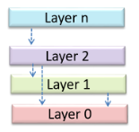

* **Client-server style**
    - At least one component playing the role of a server
    - At least one component accessing the services of the server
    - Often used in: distributed applications, web applications

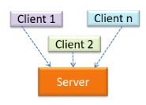

* **Event-driven style**
    - Style controls the flow of the application by
        - Detecting events from event _emitters_
        - (An event is a notable occurrence that happens inside or outside the software, e.g. click button, timer running out, minimising a window)
        - Communicating those events to interested event _consumers_ (interested in reacting to that event)
    - Often used in: GUIs

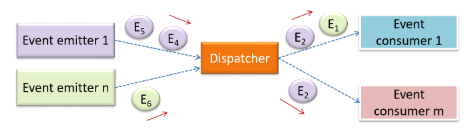

* **Transaction processing style**
    - Style divides the workload of the system down to a number of _transactions_ which are then given to a _dispatcher_ that controls the execution of each transaction
    - Things handled by the _dispatcher_
        - Task queuing, ordering, undo etc

    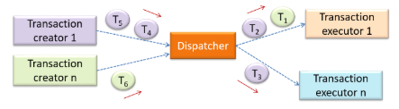

    - Examples: banking system
        - Transactions generated by terminals used by tellers (in bank)
        - Which are sent to a central dispatching unit
        - Which dispatches the transactions to various other unites to execute

    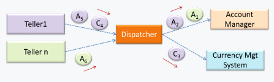

* **Service-oriented style**
    - The _service-oriented architecture (SOA)_ style builds applications by combining functionalities packaged as _programmatically accessible_
    - Aims to achieve: interoperability between distributed services (which may not be implemented using the same programming language)
    - Commonly implemented through: _XML web services_
        - Web is used as medium for services to interact
        - XML used as the language of communication between service providers and service users
    - Example:

    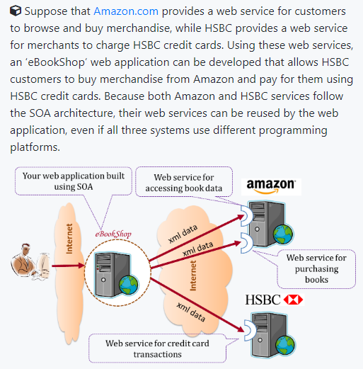

* Other architectural styles:
    - _pipes-and-filters architectures_, _broker architectures_, _peer-to-peer architectures_, _message-oriented architectures_
* How architectural styles are combined
    - Most application use a mix of architectural styles
    - Examples: Application uses client-server architecture where server component comprises several layers/n-Tier
* Draw architecture diagrams
    - No standard notation
    - Basic guidelines
    - **Minimise the variety of symbols**
        - Explain meaning of symbol if it does not have a widely-understood meaning
    - **Avoid the indiscriminate use of double-headed arrows to show interactions between components**

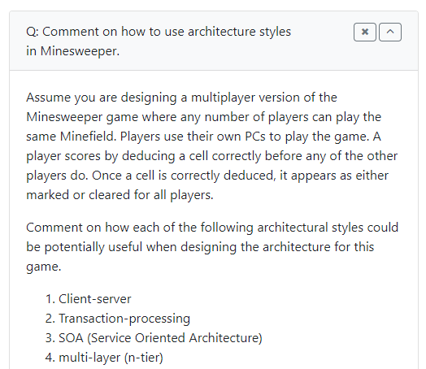
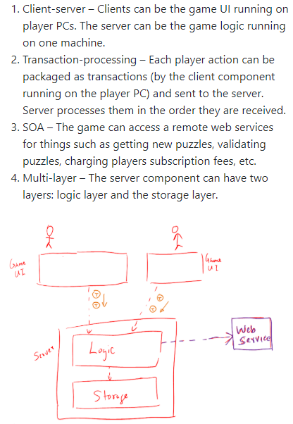

# Test Cases: Combining Multiple Inputs

* An SUT can take multiple inputs
    - Select value for each input
    - by equivalence partitioning, boundary value analysis, other technique
    - Example:
        - method to test: `calculateGrade(participation, projectGrade, isAbsent, examScore`
        - values to test:

    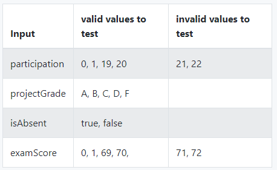

* Not efficient: testing all possible combinations
    - Higher chance of discovering bugs (i.e. effective)
    - Number of test cases can be too high (i.e. not efficient)
* Needs smarter ways to combine test inputs that are both effective and efficient
* Basic test input combination strategies
    - Using example:
        - Assume SUT has 3 inputs, `foo(p1 char, p2 int, p3 boolean)`
        - Possible values for each input
            - `p1`: `a, b, c`
            - `p2`: `1, 2, 3`
            - `p3`: `T, F`
    1. **all combinations** strategy
        - Generates test cases for each unique combination of test inputs
        - For 3 inputs example: 18 test cases

        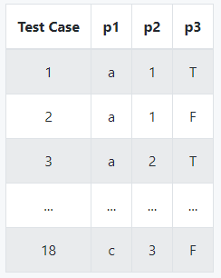

    2. **at least once** strategy
        - Includes each test input at least once
        - For 3 input example:

        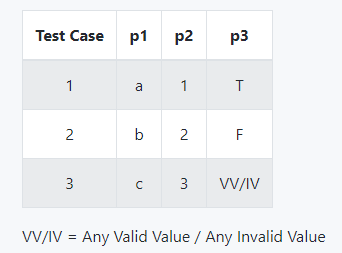

    3. **all pairs** strategy
        - For any given pair of inputs, all combinations between them are tested
        - Based on observation that a bug is rarely the result of more than 2 interacting factors
        - Resulting number of test cases is
            - lower than _all combination_ strategy
            - higher than _at least once_ strategy
        - Steps for 3 input example:

        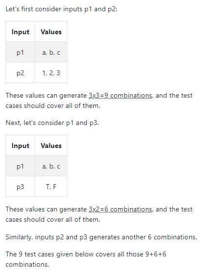

        - For 3 input example (test cases):

        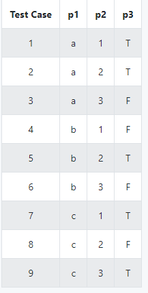

        - Variation of _all pairs_ strategy
            - Test all pairs of inputs for only inputs that could influence each other
            - Example:

            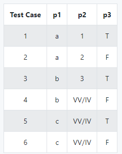

    4. **random** strategy
        - Generates test cases using one of the other strategies
        - Then pick a subset randomly
        - Presume because original set of test cases too big
* Heuristics
    - Help to make better decisions about test case design
    - Speculative in nature (especially when black-box testing)
    - Cannot give precise number of test cases
    1. **Each valid input at least one in a positive test case**
        - Example

            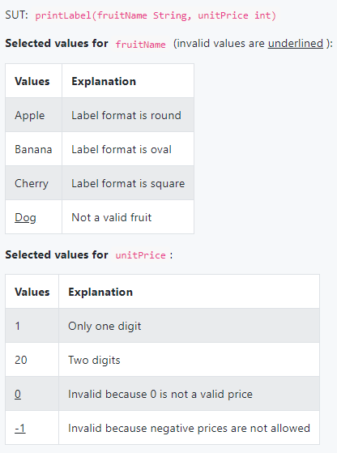
        
        - Test cases being considered

            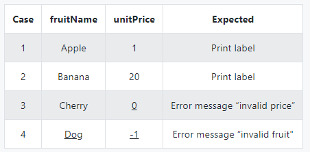

        - Looks like test cases created using _at least once_ strategy
        - But cannot confirm that square-format label printing is done correctly
        - `Cherry` (the only input that can produce a square-format label) is in a negative test case (which produces an error message instead of a label)
        - If there is a bug in the code that prints labels in square-format, these test cases will not trigger that bug
        - Solution: Ensure that `Cherry` is a valid test input, ensure that it appears at least once in a positive test case

            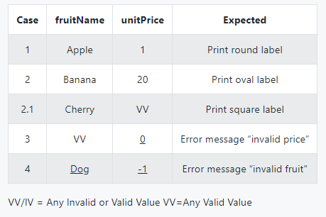
        
    2. **No more than one invalid input in a test case**
        - Make sure that the error message/invalidness is shown due to a particular invalid input value
        - Continue from example, above:

            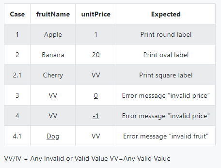

    3. **Mix**
        - Apply multiple test input combination techniques together
        - TODO

# Other QA Techniques

* Software Quality Assurance (QA): process of ensuring that the software being built has the required levels of quality
* Complementary techniques to testing
    - _static analysis_, _code reviews_, _formal verification_
* **Quality Assurance = Validation + Verification**

| **Validation** | **Verification** |
| --- | --- |
| _Are we building the right system?_ | _Are we building the system right?_ |
| Are the requirements correct? | Are the requirements implemented correctly? |
| E.g. acceptance testing | E.g. developer/system testing |
| Bugs in the requirements | Bugs in the code |
| | E.g. system crash (verification failure) |

* Important that both are done
    - (Don't limit to verification)
    - Not very important to clearly distinguish between the 2
* **Formal verification**
    - Uses mathematical techniques to prove the correctness of a program
    - More commonly used in safety-critical software
        - E.g. flight control systems
    - When not practical to proof through exhaustive testing

| Advantages | Disadvantages |
| --- | --- |
| Can prove absence of errors (testing can only prove presence of error, not absence) | |
| | Only proves the compliance with specification, not actual utility of software |
| | Requires highly specialised notations and knowledge, expensive technique to administer |

# Reuse

# Cloud Computing

* Cloud computing: delivery of computing as service over the network
    - Rather than product running on local machine
* Actual hardware and software located in a remote location (typically, a large server farm), and users access them over the network
* Maintenance of hardware and software managed by cloud provider, users typically pay for only the amount of services they use
    - Model similar to consumption of electricity (power company, power plant, consumer pays for electricity they used)
* Cloud computing model optimises hardware and software utilisation to reduce cost to consumers
* Users can scale up/down their utilisation at will without having to upgrade their hardware and software
* Traditional non-cloud model of computing is similar to everyone buying their own generators to create electricity for their own use
* Cloud computing can deliver computing services at 3 levels
    1. **Infrastructure as a service _(IaaS)_ delivers computer infrastructure as a service**
        - Example 1: user can deploy virtual servers on cloud instead of buying physical hardware and installing server software on them
        - Example 2: customer using storage space on cloud for off-site storage of data
        - Example 3 (IaaS cloud provider): Rackspace, Amazon Elastic Compute Cloud (Amazon EC2)
    2. **Platform as a service _(PaaS)_ provides a platform on which developers can build application**
        - Developers no need to worry about infrastructure issues
            - E.g. deploying servers, load balancing (like in IaaS)
        - Automatically taken of by platform
        - Price to pay: reduced flexibility
            - Applications written on PaaS are limited to facilities provided by platform
        - Example: Google App Engine (build apps using Java, Python, PHP, GO), Amazon EC2 (any language)
    3. **Software as a service _(SaaS)_ allows applications to be accessed over the network**
        - No need to install on local machine
        - Example: Google Docs (SaaS word processing software) vs Microsoft Word (traditional word processing software)

# Other UML Models

1. **Deployment Diagrams**
    - Shows a system's physical layout
    - Reveals which pieces of software run on which pieces of hardware

    
    
2. **Component Diagrams**
    - Used to show how a system is divided into components
    - Show how they are connected to each other through interfaces

    

3. **Package Diagrams**
    - Shows packages and their dependencies
    - _Package_ is a grouping construct for grouping UML elements (classes, use cases, etc)

    

4. **Composite Structure Diagrams**
    - Hierarchically decomposes a class into its internal structure 

    

5. **Timing Diagrams**
    - Focuses on timing constraints

    

6. **Interaction Overview Diagrams**
    - Combination of activity diagrams and sequence diagrams

        

7. **Communication Diagrams**
    - Like sequence diagrams but emphasise the data links between the various participants in the interaction rather than the sequence of interactions

        

8. **State Machine Diagrams**
    - Models state-dependent behaviour
    - Aka: _state-charts_, _state diagrams_, _state machines_
    - When application response is dependent on its internal state
    - Example:

    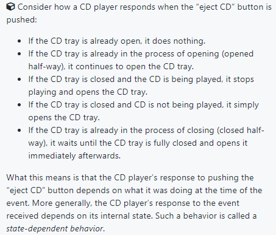

    - State-dependent behaviour displayed by an object in system often simple enough to no need extra attention
        - E.g. _conditional behaviour_: `if x>y, then x=x-y`
    - Sometimes, objects may exhibit state-dependent behaviour that is complex enough that it needs to be captured in a separate model
        - Modelled through UML _state machine diagrams_ (SMD)
    - Views the life cycle of an object as consisting of a finite number of states where each state displays a unique behaviour pattern
    - Captures information such as
        - States that object can be in, during its lifetime (captures object's behaviour over its full life cycle)
        - How object response to various events while in each state
        - How object transits from one state to another
        - (_Different from sequence diagrams: capture object behaviour one scenario at a time_)
    - Example (SMD for Minesweeper game):

    

    