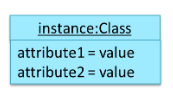

# CS2103 Notes

# Week 4

### Models

* Representation of something else
* Provides simpler view of a complex entity, captures only a selected aspect
    - Models are abstractions
* **Class diagram**
    - Models that represents a software design
    - Captures the structure of software design but not the behaviour
* May need multiple models of same entity to capture it fully
* Purpose of models
    1. For analysis
        - Aid understanding of problem to solve
        - Models of problem domain/environment in which the software is expected to solve the problem
        - Helps to figure out how the solution is to be built
        - E.g. Architecture diagram
    2. To communicate information among stakeholder
        - Visual aid in discussion
        - Documentation
        - Explaining high-level design of software to developers
        - E.g. _Use case diagram_ to explain functionality
        - E.g. _Class diagram_ from reverse-engineering the code to explain design of component to new developer
    3. Blueprint for creating software
        - Used as instructions
* Model Driven Development (MDD)
    - Also called _Model-driven engineering_
    - Approach to software development that strives to exploit models as blueprints
    - Use models as primary engineering artifacts when developing software
    - First model, then code
    - Conversion to code, code-generation techniques
        - Automated, semi-automated
        - Manual translation
    - Requires use of very expressive modeling notation (graphical or otherwise), often specific to given problem domain
    - Advantage
        - Same model can be used to create software for different platforms, languages

## UML Models

* Unified Modeling Language (UML)
* Graphical notation to describe various aspects of software system
* Current _de facto_ modeling notation used in software industry

In an OO solution,

| UML| _Object Diagrams_ | _Class Diagrams_ |
| --- | --- | --- |
| Models | Object structures | Class structures |

## OO Structures

* Model how relevant objects are 'networked' together
* Object structures within same software can change over time
    - But do not change at random
    - Change based on set of rules
* Rules that object structures need to follow
    - Illustrated as a _class structure_
    - i.e. Structure that exists among relevant classes

## Class Diagrams

* Describe structure of an OOP solution
    - But not behaviour
* Basic UML notation to represent _class_:

* Example:

* May omit if such details not important:
    - _Attributes_ compartment
        - All attributes should be in one compartment
        - Can be empty
        - Has to be **above** operations compartment
    - _Operations_/_Methods_ compartment
        - All methods should be in one compartment
        - Can be empty
* _Visibility_ of attributes and methods
    - Indicate level of access allowed
    - Types of visibility and meaning depends on programming language used

* **Underline** denotes class-level attributes and variables
    - E.g. `totalStudents`, `getTotalStudents()`
* **Associations**
    - Main connections among classes in class diagram
    - Connections between objects
    - Can change over time
    - Associations among **objects** can be generalised as associations between corresponding classes too
    - Use instance level variables to implement associations
    - Example (**solid lines**):

    

    - Additional decorations
        - Adds information to class diagram
        1. Association labels
        2. Association roles
        3. Multiplicity
        4. Navigability

### Association Labels

* Describe the meaning of the association
* Notation: "label >"
    - Arrow head indicates direction in which label is to be read
* Example:

    

### Association Roles

* Assoc Role labels used to indicate role played by classes in the association
* Variable names match closely with association roles
    - E.g. `Woman wife` variable has `Woman` class with `wife` label
* Example:

    

### Multiplicity

* Aspect of OOP solution that dictates how many objects take part in each association
* Normal instance-level variable
    - `0..1` multiplicity (i.e. optional associations)
    - A variable can hold a reference to a single object or `null`
    - Example:
<!-- -->
    // Logic class has variable that can hold either 0 or 1 Minefield objects
    class Logic{
        Minefield minefield;
    }

    class Minefield{
        ...
    }

* Variable can be used to implement a `1` multiplicity
    - i.e. _compulsory association_
    - Example:
<!-- -->
    // Logic class will always have a ConfigGenerator object, provided the variable is not set to null at some point
    class Logic {
        ConfigGenerator cg = new ConfigGenerator();
        ...
    }

* Bi-directional associations require matching variables in both classes
    - E.g. Each object can have an association with an object of the other type
    - Example:
<!-- -->
    class Foo {
        Bar bar;
        //...
    }

    class Bar {
        Foo foo;
        //...
    }

* One-to-many associations
    - E.g. Array, ArrayLists, HashMaps, Sets etc.
* Notation

    

| Notation | |
| --- | --- |
| `0..1` | _Optional_ (linked to 0 or 1 obj) |
| `1` | _Compulsory_ (linked to one obj at all times) |
| `*` | Linked to **0** or more obj |
| `n..m` | Number of linked objects must be `n` to `m` inclusive |

### Navigability

* Concept of which class in the association knows about the other class
    - 2 classes linked by an association do not necessarily know about each other
    - Knowing about the other class means that its object will hold an object of the other class in one of its variables
* Can be shown in both class and object diagrams
* Notation: arrow head
* Example (obj diag):

    
* Another example (class diag):

    

### Associations as Attributes

* Can show an association, association multiplicities and default value as an attribute instead of a line
* Notation: `name: type [multiplicity] = default value`
* Example:
    - A `Piece` may or may not be on a `Square` in a boardgame
    - `isOn` attribute either `null` (default value) or hold a reference to a `Square` object (matches `0..1` multiplicity association)

    

* Example:
    - Association that a `Board` has 100 `Square` s

        

### Types of Associations (4)

1. **Inheritance**
    - Notation: Triangle and solid line (NOT arrow)

        

2. **Compositions**
    - When a object consists of objects from another class
    - Association that represents a string _whole-part_ relationship
    - **When the _whole_ is destroyed, _parts_ are destroyed as well**
    - E.g. `Book` consists of `Chapter` objects
    - Notation: Solid diamond symbol

    

    - Implies that there cannot be cyclical links
    - Code implementation:
        - Using normal variable
<!-- -->
    // subject is part of email 
    class Email {
        private Subject subject;
    ...
    }

3. **Aggregations** (not really used)
    - _Container-contained_ relationship
    - Weaker relationship than composition
    - Notation: hollow diamond

    

    - Code implementation:
        - Similar to _composition_ except _containee_ object can exist even after the _container_ object is deleted
<!-- -->
    // agg assoc between Team class and Person 
    class Team {
        Person leader;
        ...
        void setLeader(Person p) {
            leader = p;
        }
    }

4. **Dependencies**
    - Need for one class to depend on another without having a direction association with it
    - E.g. Interactions between objects that do not have a long-term link between them
    - Notation: dashed arrow

    

    - Code implementation:
        - Transient interaction
        - E.g. `Foo` object **does not keep** `Bar` object it receives **as a parameter**
<!-- -->
    class Foo{
        
        int calculate(Bar bar){
            return bar.getValue();
        }
    }

    class Bar{
        int value;
        
        int getValue(){
            return value;
        }
    }

### Notes

* UML notes augments UML diagrams with additional information
* Can be connected to a particular element in diagram
* Can be shown without a connection
* Notation: A box
* Example:

    

### Constraints

* Specify constraints in UML diagram
* Constraint can be given inside a note, within curly braces
* E.g. The accepted range for a variable like the face values of a die
* Specify constraints with
    - Natural language
    - Formal notation (e.g. OCL, Object Constraint Language)

    

### Modelling class-like entities

1. Enumerations
    - Fixed set of values that can be considered as a data type
    - Often useful when regular data type (e.g. `int`, `String`) would allow invalid values to be assigned to a variable
    - Notation:

    

    - Example:

    

2. Abstract classes
    - Such classes cannot be instantiated, but can be subclassed
    - Can declare when class is merely a representation of commonalities among its subclasses
    - Abstract method is a method signature without method implementation
    - Class that has abstract method becomes abstract class
        - Class definition incomplete
        - Not possible to create objects using an incomplete class definition
    - Notation:
        - Italics or `{abstract}` keyword (preferred)

    

3. Interfaces
    - Behaviour specification
    - Collection of method specification (i.e. method signature without any implementation)
    - If class implements interface, class able to support the behaviours specified in interface
    - Class implementing an interface results in an _is-a_ relationship (like class inheritance)
    - Notation:
        - Similar to class with additional keyword `<<interface>>`
        - Dashed line for interface inheritance with triangle

    

## Association Classes

* Represents additional information about an association
* Normal class but has a special role from design POV
* Store data related to association
* Not suitable if information is property of one of the classes
* E.g. `Man` and `Woman` married can have `Marriage` association containing information on marriage
* Notation
    - Denoted as a connection to an association link using dashed line

        

* Example:

    
* Code implementation
    - No special way
    - Implemented as a normal class that has variables to represent the endpoint of the association it represents
<!-- -->
    // Association class between 2 Person objects
    class Transaction{
        
        //all fields are compulsory
        Person seller;
        Person buyer;
        Date date;
        String receiptNumber;
        
        Transaction (Person seller, Person buyer, Date date, String receiptNumber){
            //set fields
        }
    }

## Object Diagrams

* Shows object structure at given point of time
* Can be used to complement class diagrams
    - E.g. Use them to model different object structures that can result from a design represented by a given class diagram (i.e may be able to translate obj diag to class diag)
* Notation: 
    - `objectName:ClassName`
        - Underlined
        - an instance of `ClassName` identified as `objectName`
    - No compartment for methods
    - Can be omitted if not relevant
        - _Attributes_ compartment
        - Object name (if unnamed instance)

    

## Object vs Class Diagrams

| | Object diag | Class diag |
| --- | --- | --- |
| Shows | objects | classes |
| | May have instance name | |
| | A `:` before class name | |
| | Underlined instance and class names | |
| Omitted (confirm) | Methods, multiplicities | |

* Multiple object diagrams can correspond to a single class diagram
    - The same class diagram can have many 'instances'
    - Example:

    

## JavaFX

* Technology/framework for building Java-based GUIs
* Previously part of Java
* Currently a third-party dependency
* Maintained by OpenJDK
* JavaFX lifecycle of an application
    - `Nodes`: fundamental building blocks of a JavaFX app
        - Can be interacted with like Plain Old Java Objects (POJO)
    - `Scene`: where `Nodes` are placed on 
    - `Stage`: where `Scene` is set on, provided by JavaFX
        - Can be thought as a window

    

* Calling `Stage#show()` method renders a window with `Stage` on it
* Has _event-driven architecture style_
    - Programmatically define _handler_ methods to execute as response to certain _events_
    - When event detected, JavaFX will call respective handlers

### JavaFX controls
* Reusable UI elements
* Some controls:
    - ImageView (avatar)
    - Label (text)
    - Button
    - TextField (input)
    - ScrollPane (scroll bar for window)
* Root `Node` can contain many other `Nodes` which in turn can contain many other `Nodes`
* To show all controls on screen at once
    1. Find a **container** to set as root `Node`
    2. Place all other `Nodes` in it
* To get exact layout in UI
    - Use **layout panes** in `javafx.scene.layouts`
    - Each layout pane follows a _layout policy_ to decide how to arrange its children
    - E.g. single vertical column (`VBox`), single horizontal row (`HBox`)
* Example

    

### JavaFX events
* Some events:
    - `onAction` event
        - User pressing `Enter` in `TextField`
    - `onMouseClicked` event
        - User left-clicking `Button`

## varargs

* Feature of Java
* Variable Arguments (varargs)
* _Syntactic sugar_ type feature that allows methods to take variable number of arguments
    - Arguments divided by commas, as if many arguments
* Notation: using `...` before in variable name (when defining arguments for a function)
* Example:
<!-- -->
    // Can have search("book"), search("book", "paper")
    public static void search(String ... keywords){
    // method body
        for (String s : keywords) {
            // ...
        }
    }

## Managing Pull Requests

* PRs are updated automatically to reflect new code
* Revising code based on reviewer comments
* Merge PR
    - GitHub page of PR
    - Scroll to bottom of `Conversation` tab
    - Click `Merge pull request` button
    - Click `Confirm merge` button
* After PR is merged
    - `Pull request successfully merged and closed` message
    - Sync local repo with remote repo
        - `git checkout master`
        - `git pull origin master`

## Code Reviews

* Systematic examination code
* Intention of finding where the code can be improved
* Various forms of review:
    1. Pull Request reviews
        - Project Management Platforms (e.g. GitHub, BitBucket) allow new code to be proposed as PR
        - Provide ability for others to review code in PR
    2. Pair programming
        - Involves 2 programmers working on the same code at the same time
        - Implicit review of the code by the other member of the pair
    3. Formal inspections
        - Involve a group of people systematically examining a project artifact to discover defects
        - Members of the group play various roles during process
            - author: creator of artifact
            - moderator: planner, executor of inspection meeting
            - secretary: recorder of findings of inspections
            - inspector/reviewer: inspects/reviews artifact
* Advantages (over testing)
    - Can detect functionality defects
    - Can detect problems like coding standard violations
    - Can verify non-code artifacts and incomplete code
    - Do not require test drivers, stubs
* Disadvantages
    - Manual process
    - So, error prone
* Tips
    - Objective, concise, deal with certainties whenever possible
    1. Rephrase objection as question
        - **BAD** e.g. _"This change will make XXX impossible"_
        - **GOOD** e.g. _"How can we do XXX with your change?"_
    2. Avoid hyperbole
        - Just state concerns and ask questions to help get to desired outcome
        - **BAD** e.g. _"This change will destroy performance"_
        - **GOOD** e.g. 
            - _"It seems like doing X might be slower than existing Y, have you measure/gathered data to show it isn't? In the meantime, I am gathering data to try to verify that X is not slower than Y"
            -  _"This change changes this single loop O(n) to a doubly nested loop O(n^2), won't this affect performance?"_
    3. Keep snide comments to yourself
        - **BAD** e.g. _"I think this change is bad and will ruin everything"_
    4. Engage positively
        - Maybe have different idea about how to solve problem
        - Maybe will find solution that is better than original solution
    5. Remember that not everyone's experience is identical to yours
        - It's okay to state the obvious, as long as it isn't patronising or snide
        - **GOOD** e.g. _"This is incorrect because it causes a null pointer exception when X is Y"_
    6. Don't diminish the complexity of something that's not obvious
        - Things obvious to you may not be for others
        - Suggest alternative approaches and point out useful examples to get everyone to understand
        - **GOOD** e.g. _"It might be possible to frob the gnozzle, which would simplify this part (see XXX for an example)"_
    7. Be respectful
        - If a submission is not up to standard
        - **GOOD** e.g. _"Thanks for your contribution. However, it cannot be accepted in its current form: there are multiple problems (as outlined above)"_
    8. Manage expectations and time
        - If submission too large to be reviewed, okay to let submitter know right away
        - Don't ignore it until it goes away
        - **GOOD** e.g. _"Could you please break this down into smaller changes? I do not have a lot of time for code reviews and this one is just too large/complex to review in one pass"_
    9. Say please
        - Especially when you want something to be different due to formatting/style (minor detail of change)
        - **GOOD** e.g. _"Could you please align these variables definitions so they're easier to read?"_
    10. Start the conversation
        - If not sure why you don't like it, okay to ask to discuss

## Static Analysis

* Analysis of code without actually executing the code
* Can find useful information
    - E.g. Unused variable, unhandled exceptions
    - E.g. style errors, statistics
* Higher-end static analyse tools
    - Perform more complex analysis
    - E.g. Locate potential bugs, memory leaks, inefficient code structures etc.
* _Linters_
    - Subset of static analysers
    - Specifically aim to locate areas where the code can be made 'cleaner'