# CS2103 Notes (Week 6)

# Week 5 (Lecture - 13/9)

 * Doc comments should not include where the method will be used, because no control over it
 * Method doc comments
    - Verbs: _runs_, _constructs_
 * When defining methods, defining new vocabulary for readers
        - E.g. method name, variable names
        - Nouns and verbs
* SLAP
    - 2 levels is still all right
* Good code looks neat
* Learn smarter
    - Find out about things
    - At least what it does
    - When the time comes, can just find out more on how to use it
* Learn gradually at your own pace

## Modeling: Sequence Diagrams

* Interactions between components for a given scenario
* Self-call and call-backs
* Alternative paths (`if-else`) and optional paths (`if`)

## Modeling: Architecture Diagrams

* High-level structure
* Important technical decisions
    - E.g. servers
* Multi-level design
    - Class diagrams that do not span entire system
    - Instead OOP Component Design
    - For each component, focus only on it
        - Methods within it
    - Connect to components (i.e. classes) it calls with an arrow to a general box

## Product Design

* Personal, subjective observations about product design
* Everything you do should add value to the user
    - Not for your learning
* Minimise work for users
* Think from the user's point of view
    - To get the features
* Simple, the better
* Some users don't like flexibility and making choices
* Don't force users to read the user manual
    - Populate with well-chosen sample data
    - Contextual tups
    - Informative error messages
* Handle user input errors
* Focus on the benefits, not the features
* Visualise usage
    - Personas
    - Situation, context of use
    - First use: sample data? Tutorial?
    - Second and more use?
* Biggest aspect: **care** for the users
    - Figure out what users want
    - Main thing is that users have to like it

## Logging

* Keep record of what happen
* `log()`
    - E.g. `log(LEVEL_INFO, "Setting size to small")`
    - E.g.`log(LEVEL_WARN, "Size not recognised")`
* Can control what levels to show (e.g. when system is more developed, just show warnings)

## Breakpoints
* In IDE
* Specify the breakpoint
* Run program in debug mode
* Stops at breakpoint
* Shows values of variables at that point
* Can show values in next line etc.

## IDE Shortcuts

* `ctrl-Shift-v`: show list of things copied
* `ctrl-Shift-n`: find a method by search

# Modeling: UML Sequence Diagrams

* Diagram captures the interactions between multiple objects for a given scenario

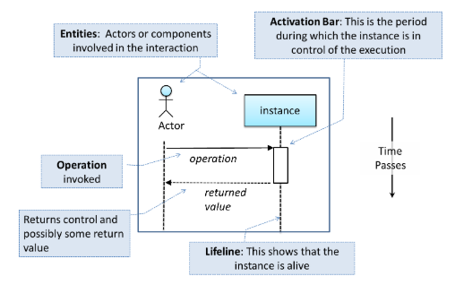

* Instance of a class
    * E.g. `:TextUI`: unnamed instance of class `TextUi`
    * E.g. `TextUi1:TextUi`, `TextUi2:TextUi`: 2 instances of `TextUi` which are distinguished by naming them
* **(Solid) Arrows**: represents method calls
* **(Dashed) Arrows**: represents method returns
* Class/object name **not** underline in sequence diagrams
* Common notation errors:
    1. _Activation bar too long_
        - Activation bar of a method canot start before the method call arrives
        - Method cannot remain active after method has returned
        - i.e. Arrows should connect at the start and end of activation bar (not middle)
        - Example: method `Foo#xyz()`
        
    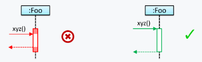
    
    2. _Broken activation bar_
        - Activation bar should remain unbroken from the point the method is called until method returns
    

## Loops

* Notation:

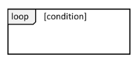

* Example:
    - `Player` calls `mark x, y` command or `clear x y` command repeatedly until game is won or lost

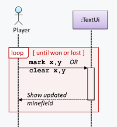 

## Object Creation

* Notation:
    1. **Arrow** that represents the constructor arrives at the side of box representing instance
    2. **Activation bar** represents period that constructor is active

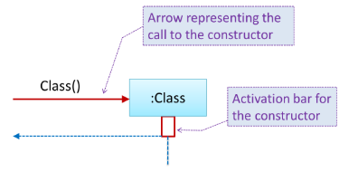 

## Object Deletion

* UML uses an `X` at the end of the lifeline of an object to show it's deletion
* Note: Although object deletion is not that important in languages (e.g. Java) that support automatic memory management, still can show deletion in UML diagrams to indicate the point at which the object ceases to be used
* Notation:

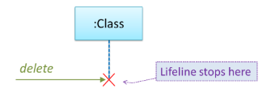 

## Self-Invocation

* Show a method of an object calling another of its own methods
* Notation:

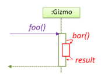

* **_call back_**
    - Example:
    - `Book#write()` method calling `Chapter#getText()` which in turn does a _call back_ by calling `getAuthor()` method of calling object

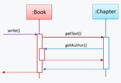

## Alternative Paths

* Use `alt` frames to indicate alternative paths
* Notation:

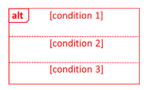

* For paths like `if-else` statements etc.
* Example:

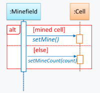

## Optional Paths

* Use `opt` frames to indicate optional paths
* Notation:

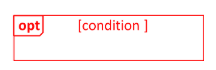

* Example:

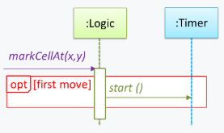

## Reference Frames

* UML uses _ref frame_ to allow **segment of interaction** to be omitted and shown as a separate sequence diagram
* Helps to:
    - break complicated sequence diagrams into multiple parts
    - simply omit details not interested in showing
* Kinda like referencing to another diagram that zooms in on the interactions
* Notation:

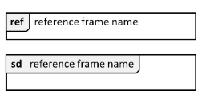

* Example:

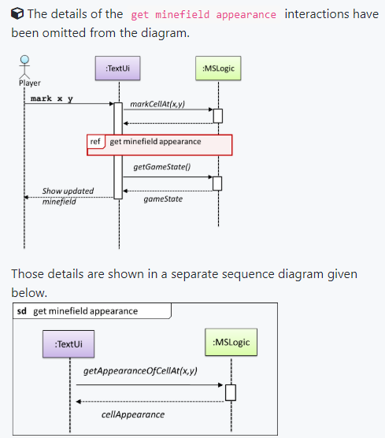

## Parallel Paths

* Use `par` frames to indicate parallel paths
* Note: If show parallel paths in a sequence diagram, the corresponding Java impementation is likely to be _multi-threaded_ because normal Java program cannot do multiple things at the same time
* Notation:

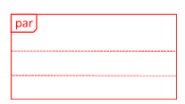

* Example
    - `Logic` calling methods `CloudServer#poll()` and `LocalServer#poll()` in parallel

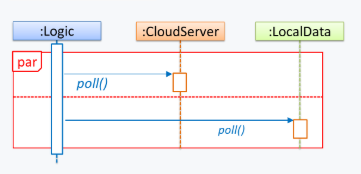


## Sequence Diagram: Questions

* Explain sequence diagram
* Draw sequence diagram for code snippet
* Explain interactions in sequence diagram
    - Example

    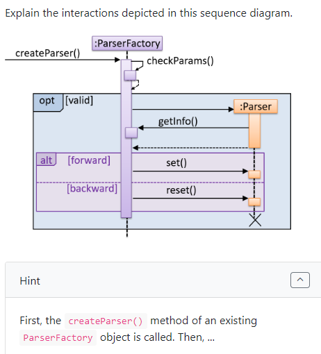


# Architecture Diagrams

* Software architecture of a program or computing system
* Structure(s) of system
* Comprises of
    - Software elements
    - Externally visible properties of those elements
    - Relationships among elements
* Concerned with
    - The public side of interfaces
    - **NOT** Private details of elements
    - **NOT** Details having to do solely with internal implementation
* Shows the overall organisation of the system
    - Can be viewed as a very high-level design
* Usually consists of
    - Set of interacting components
    - They fit together to achieve the required functionality
* Should be
    - Simple and technically viable structure
    - Well-understood, agreed-upon by everyone in the development team
    - Forms the basis for implementation
* Typically designed by _software architect_
    - Provides technical vision of system
    - Makes high-level (architecture-level) technical decisions about project
* Example:
    - Possible architecture for _Minesweeper_

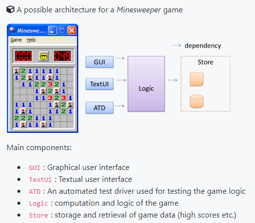

## Reading

* Architecture diagrams are **free-form** diagrams
* No universally adopted standard notation
* Can use any symbol that reasonably describes the architecture
* Examples:
    - _TEAMMATES_
    - `se-edu/addressbook-level3`
    - etc.

    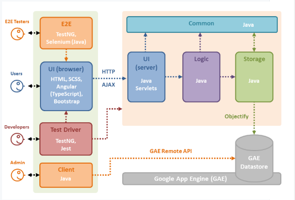
    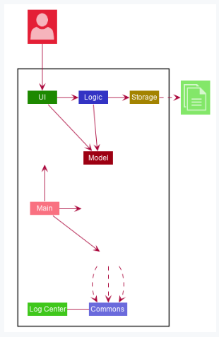
    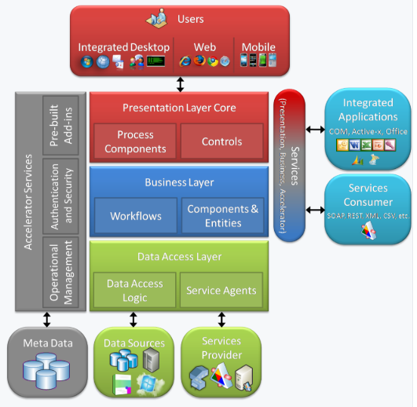
    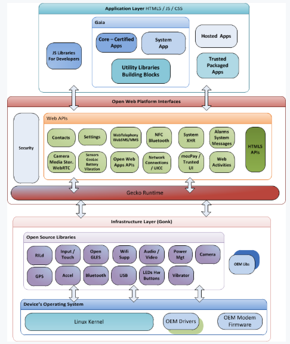
    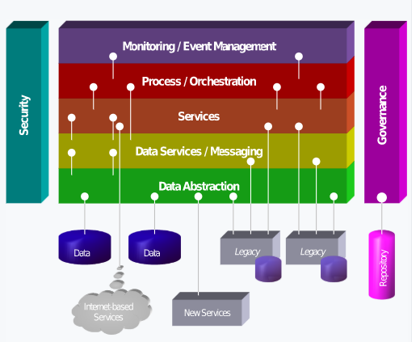

## Multi-Level Design

* In smaller system, design of entire system can be shown in one place
* But design of bigger systems need to be done/shown at multiple levels
* Break up system into components, show low-level designs of components
* Example:

    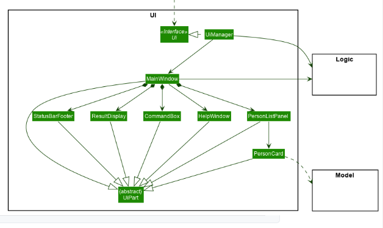

# IDEs: Basic Features

## Debugging

* Process of discovering defects in the program
* **BAD** approaches
    - Inserting temporary print statements
        - Ad-hoc approach to print information relevant to debugging
        - Incurs extra effort when inserting and removing print statements
        - Extraneous program modifications increases the risk of introducing errors into the program
        - If not promptly removed after debugging, may appear unexpectedly in the production version
    - Manually tracing through the code
        - Also known as 'eye-balling'
        - Difficult, time consuming, error-prone technique
        - If didn't spot error while writing code, might not spot error when reading code too
* **GOOD AND RECOMMENDED** approach
    - Use a debugger
        - Allows the pausing of execution
        - Then stepping through one statement at a time while examining internal state if necessary
        - Most IDEs come with an inbuilt debugger
-----
* intellij
    - Click on space next to code line number for red dot
* _watch variable_
    - In debug console, can add a variable you wish to tracl
    - E.g. you want to see changes in size of array
    - Instead of looking at details of array, watch the variable `arr.size()`
    - See the number directly
* _step over_
    - Goes to the next line of execution in debug mode
* _step into_
    - When you feel something amiss because of a method that was called from another class
    - In debug mode, can step into that method from the other class to execute line by line
    - _step out_ to leave that method, back to original line
* _conditional breakpoint_
    - Stop execution when certain conditions are met
    - E.g. many iterations of a loop, have a hunch that error occurs in one of those loops but don't know which
    - In intellij, right-click on breakpoint to set condition
-----
* Help: 
    - https://www.jetbrains.com/help/idea/debugging-code.html
    - https://www.youtube.com/watch?time_continue=1&v=1bCgzjatcr4

## Code Navigation

* Useful navigation shortcuts

| Shortcut | Description |
| --- | --- |
| | Go to the definition of a method from where it is used |
| | View the documentation of a method from where the method is being used, without having to navigate to the method itself |
| `Shift-CTRL-A`| Find action |
| `Shift-CTRL-F12` | Hides side windows and expand editor |
| `ALT-1` | Open up hidden project window |
| `ALT-9` | Open up hidden version control window | 
| `Esc` | Opens up hidden windows again |
| `CTRL-E` | Select recent files |
| `Shift-CTRL-E` | Brings up recent locations (not just file, but particular code snippet) |
| `CTRL-N` | Search for classes |
| | Can search by CamelCase (e.g. `DoYouKnow`, use `DYK` ) |
| `Shift-CTRL-N` | Search for a file (not necessarily `.java`) |
| `Shift-CTRL-Alt-N` | Search for method (Find where a method/field is being used)| 
| `CTRL-Alt-LeftArrow` | Navigate backward (go back to previous location) |
| `CTRL-Alt-RightArrow` | Navigate forward |
| `Alt-F7` | Find usages of a class |
| `Shift-CTRL-T` | See and select tests available for a class or vice versa |
| `Shift-Shift` | Search everywhere box |
| `CTRL-CTRL` | Run anything (brings up recently run tests or apps) |
| | No need to navigate to file itself |
| `CTRL-F2` | Brings up list of processes that can be stopped |
| `CTRL-F2` 2 times | Stops all processes |

* Help:
    - https://www.youtube.com/watch?v=1UHsJyCq1SU

# Logging

* Deliberate recording of certain information during a program execution for future reference
* Typically written to a log file
    - Also possible to log information in other, e.g. into a database, remote server
* Useful for troubleshooting problems
    - Regularly record some system information
    - When bad things happen (e.g. unanticipated failure), associated log files may provide indication of what went wrong
    - Can take action prevent it from happening again
* Log file like a black box (flight data recorder) of an airplace
    - Don't prevent problems
    - But helpful in understanding what went wrong after the fact
* Most programming environments come with logging systems that allow sophisticated forms of logging
    - E.g. ability to enable, disable logging easily
    - E.g. ability to change logging intensity (how much info to record)
* Log message levels (descending order)
    - `SEVERE`, `WARNING`
    - `INFO`, `CONFIG`
    - `FINE`, `FINER`, `FINEST`
-----
* Guidelines to levels:
    - Default should be no lower than `info`
    - `fatal`: Severe errors that cause premature termination
        - Expect these to be immediately visible on status console
    - `error`: Other runtime errors or unexpected conditions
        - Also expect them to be immediately visible
    - `warn`: Use of deprecated APIs, other runtime situations
        - Poor use of API, 'almost' erros
        - Situations that are undesirable or unexpected but not necessarily 'wrong'
        - Also expect to be immediately visible
    - `info`: Interesting runtime events (start up/shut down)
        - Be conservative and keep to minimum
        - Also expect to be immediately visible
    - `trace`: More detailed information
<!-- -->
    // Java default logging mechanism
    import java.util.logging.*;
    // Create a Logger
    private static Logger logger = Logger.getLogger("classNameORloggerName");

    // Log information using Logger object
    // Logging level can be set
    logger.log(Level.INFO, "going to start processing");
    logger.log(Level.WARNING, "processing error", ex)

* Set logger to a certain level, such that all messages of that level and higher severity are logged
    * By default, logger connects to _root logger_ which only prints `INFO` and above
<!-- -->
    LOGGER.setLevel(Level.INFO)

    // Get rid of any handlers root has
    LogManager.getLogManager().reset();

    // Everything is passed through
    myLogger.setLevel(Level.ALL);
    // Nothings is passed through
    myLogger.setLevel(Level.OFF);

* Handlers
    - Can have multiple handlers
    - To specify if want to print to console (which _root logger_ does by default)
    - Or it want to save output to a file
<!-- -->
    ConsoleHandler ch = new ConsoleHandler();
    ch.setLevel(Level.SEVERE);
    myLogger.addHandler(ch);
    myLogger.info(e); // exception

    FileHandler fh = new FileHandler("myLogger.log");
    fh.setLevel(Level.FINE);
    myLogger.addHandler(fh);
    fh.setFormatter(myFa); // default: XML

* Put these in a separate method and call it in the `main` class
    - E.g. `.setUp()`
* Logs will be overwritten
* Tips
    - Use fully qualified class name of class as name of Logger
    - Create `toString()` for classes that will appear in logging statements
    - Logging too much may cause performance issues
        - E.g. thread starvation, insufficient storage
    - Be concise and descriptive
        - Should contain both data and description
    - Consider carefully which information to include in pattern
        - E.g. pointless to log date if log rolls every hour since date already included in log file name
    - Log method arguments and return values
        - E.g. When you don't have a debugger because bug manifested itself on a customer environment a few days ago, all you have is logs
    - Watch out for external systems
        - Consider logging every piece of data that comes out from application and gets in
    - Avoid logging exceptions
        - Especially logging exception, wrapping it (i.e. throw another custom exception with `e`) and throw it back

# Documentation Tools

## Markdown

* Lightweight markup language with plain text formatting syntax

| Example | Description |
| --- | --- |
| `` | Embed images |
| `> Coffee.`| Quote someone (use `>` character before the line) |
| ` ``` ... ``` `| Code fencing to style code without indentation |
| ` ```javascript ``` ` | Style code with syntax highlighting |
| `@jamminity` | Direct comment at someone in GitHub |
| `- [x]` and `- [ ]`| Tasks lists in GitHub (if in first comment of Issue, will see a progress bar in list of issues/ or PRs) |
| `16c999e8c71134401a78d4d46435517b2271d6ac` | SHA references, link to commit on GitHub |
| `#1` | Issue references within repo, linked to that issue |
| `~~this~~` | Strikethrough |

## AsciiDoc

* Similar to Markdown but has more powerful and also complex syntax

https://asciidoctor.org/docs/asciidoc-writers-guide/
