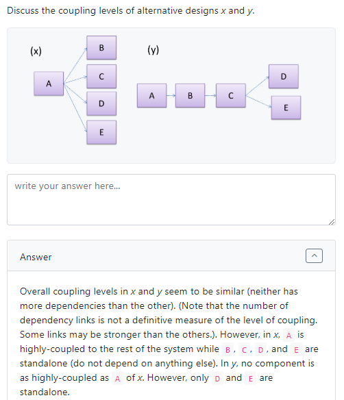
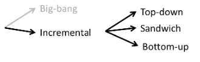
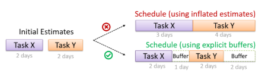
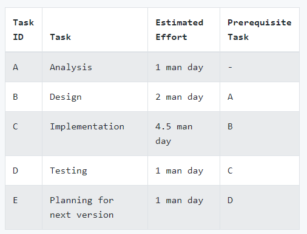
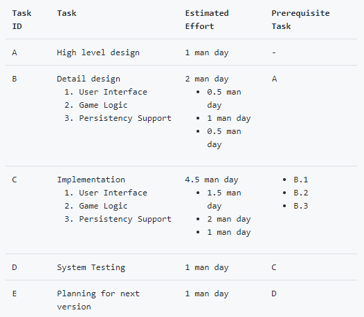
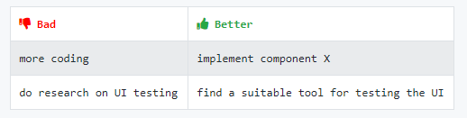
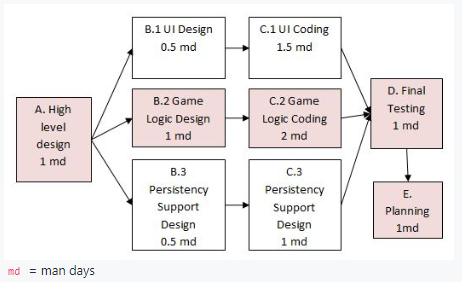
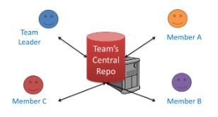
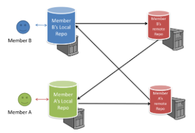

# CS2103 Notes Week 7

# Week 6 (Lecture - 20/9)

* iP
    - Asymmetric graphics for conversation
    - Since its not really a conversation between 2 people (echoing etc)
* Textual Use Cases
    - _Actor_
    - _Main success scenario_ (steps)
    - _Inclusion_
        - Underline
    - _Extensions_ 
        - E.g. extension to Step 3., as Step 3a.
* Visual Use Cases
    - Actor _generalisation_
        - Something like inheritance
    - Notation for _inclusion_: `--<<include>>-->`
    - Notation for _extension_: `--<<extend>>-->`
        - Not recommended to include
        - Too many to include
* Format
    - Vision
    - Scope
    - User
    - Workflow (broad summary of what each user does)
* API
    - Application Programming Interface
    - As long have a bunch of methods that can call
    - E.g. Application: GitHub
    - E.g. Class: `String`
    - Define APIs systematically to match features
        - Work backwards from features
* Agile Design Approach
    - Start with a minimal high-level design and evolve iteratively as necessary
    - Opposite: full design upfront
    - Because things change, just work on the things that need to be done
    - Decide only when you need a feature
* Design Fundamentals
    1. Abstraction
        - _"Abstraction is broken/leaking"_: Things that are meant to be hidden aren't
    2. Coupling
        - i.e. dependency
        - When
            - If change one class, might need a change in another class
            - If both classes assess the same global variable (not immediately obvious)
                - E.g. When modify content such that other class which uses it no longer works
        - Strong and weak dependency
        - Try to reduce
    3. Cohesion
        - About how tight something is, in a component
        - Increased cohesion, usually leads to better reusability
* Continuous Integration
    - Early and frequent integration, incrementally
    - Order of integration
        - Top-down, bottom-up (use drivers), sandwich (do both and meet halfway)
* Project
    - Build automation (Gradle)
    - Continuous integration (Travis)
    - Continuous deployment (builds a `jar` file every time it releases)
* Buffers
    - Not _padding_ (i.e. allocate more time to task)
    - If task not done by deadline, know that wrongly estimate time
* Forking workflow
    - Add a branch when adding something

# Requirements: Use Cases

* Describes an interaction between the user and te system for a specific functionality of the system
* Capture functional requirements of a system
-----
* Overview (**Textual form**)
<!-- -->

    System:
    Use case:
    Actor:
    Preconditions:
    Guarantees:
    MSS:
    Extensions:

-----
* Description of a set of sequences of actions
    - includes variants
* About actions that a system performs to yield an observable result of value to an actor
* Example:
    - _Check account balance_ use case for an ATM
<!-- -->
    System: ATM
    Actor: Customer
    Use Case: Check account balance
        1. User inserts an ATM card
        2. ATM prompts for PIN
        3. User enters PIN
        4. ATM prompts for withdrawal amount
        5. User enters the amount
        6. ATM ejects the ATM card and issues cash
        7. User collects the card and the cash.

* Use case diagrams illustrate use cases of a system visually
    - Provides a visual 'table of contents' of use cases of system
    - _Stick figures_: user roles relevant to use case
    - _Ovals_: use cases
    - Example:

    

* Use case is an interaction between a system and its _actors_
* _Actor_
    - Role played by user
    - Reside outside the system
    - can be involved in many use cases
    - A single person/system can play many roles
    - Many persons/systems can play a single role
* A use case can
    - involve many actors
    - be specified at various levels of detail
    - E.g. `conduct a survey` > `take the survey` > `answer survey question`
* Tip while modeling user-system interactions
    - Start with high level use cases and progressively work toward lower level use cases
    - Be mindful at which level of details you are working on
    - Careful not to mix use cases of different levels
-----
* **Writing use case steps**
* Main body
    - Sequence of steps that describes the interaction between system and actors
    - Each step is given as a simple statement describing _who does what_
* Describe only the **externally visible** behaviour
    - Not internal details of system
    - Should minimise details that are not part of the interaction between user and system
* A step gives the intention of the actor
    - Not the mechanics
    - Usually omit UI details
* Use case description can show loops too
    - E.g. `Steps 5-9 are repeated for each Player, and for as many rounds as required until a Player reaches the 100th square`
* **Main Success Scenario (MSS)**
    - Describes most straightforward interaction for a given use case
    - Assumes that nothing goes wrong
        - E.g. all entered details correct
        - Ignore all problems
            - E.g. timeouts, network outages etc.
    - Also known as _Basic Course of Action_, _Main flow of Events_
* **_Extensions_**
    - "Add-on"s to the MSS that describe _exceptional_/_alternative_ flow of events
    - Describe variables of scenario if certain things are not as expected by MSS
    - Written notation: Appear below MSS (separate paragraph, keep MSS **self-contained**)
    - Numbering style not a universal rule but widely used convention
        - Extensions that only happen after a step of the MSS (E.g. `3a.`, `3b.`)
        - Extensions that can happen at any step (E.g.`*a.`)
    - Don't mention events likes power failures, system crashes as extensions because system cannot function beyond catastrophic failures
    - Diagram Notation: `<<extend>>` dashed arrows
        - Direction of arrow from extension to use case it extends
        - Extension Use Case Diagram Example:

        

        - Extention Use Case Example:
<!-- -->
    System: Online Banking System (OBS)
    Use case: UC23 - Transfer Money
    Actor: User
    MSS:
        User chooses to transfer money.
        OBS requests for details of the transfer.
        User enters the requested details.
        OBS requests for confirmation.
        OBS transfers the money and displays the new account    balance.
    Use case ends.

    Extensions:
        3a. OBS detects an error in the entered data.
            3a1. OBS requests for the correct data.
            3a2. User enters new data.
        Steps 3a1-3a2 are repeated until the data entered are correct.
        Use case resumes from step 4.

    3b. User requests to effect the transfer in a future date.
        3b1. OBS requests for confirmation.
        3b2. User confirms future transfer.
        Use case ends.

    *a. At any time, User chooses to cancel the transfer.
        *a1. OBS requests to confirm the cancellation.
        *a2. User confirms the cancellation.
        Use case ends.

    *b. At any time, 120 seconds lapse without any input from the   User.
        *b1. OBS cancels the transfer.
        *b2. OBS informs the User of the cancellation.
        // Okay to have multiple times of this
        // Okay to have multiple exit points for a use case
        Use case ends.

* Use case can **include** another use case
    - Useful when
        - Don't want to clutter a use case with too many low-level steps
        - A set of steps is repeated in multiple use cases
    - Diagram Notation: `<<include>>` dotted arrow
        - From use case that includes to use case that is being included (note opposite from `<<extend>>`)

            

    - Written notation: Underlined text

* **Preconditions**
    - Specify the specific state we expect the system to be in before use case starts
    - E.g. `Preconditions: User is logged in`
    - Example:
<!-- -->
    Software System: Online Banking System
    Use case: UC23 - Transfer Money
    Actor: User
    Preconditions: User is logged in
    MSS:

        User chooses to transfer money.
        OBS requests for details for the transfer.
        ...

* **Guarantees**
    - Specify what the use case promises to give us at the end of its operation
    - Like a postcondition
    - Optional
<!-- -->
    Software System: Online Banking System
    Use case: UC23 - Transfer Money
    Actor: User
    Preconditions: User is logged in.
    Guarantees:

        * Money will be deducted from the source account only if the  transfer to the destination account is successful
        * The transfer will not result in the account balance going   below the minimum balance required.
    
    MSS:

    1. User chooses to transfer money.
    2. OBS requests for details for the transfer.
        ...

* Can use actor generalisation in use case diagrams
    - Any child actor can do what a parent actor can do
    - Notation: arrow
        - Points from child actor to parent actor
        - Like UML notation for inheritance

        
* Tip: don't over-complicate use case diagrams
    - Don't try to include everything possible
    - Use case diagram is a brief summary of the use cases that is used as a starting point
    - Details of use cases given in use case descriptions
* Can include `System` as an actor
    - Indicate that something is done by system itself without being initiated by a user/external system
    - E.g. system generates daily reports at midnight
    - but **not recommended**
    - Limit use cases for modeling behaviours that involve external actor
* UML not very specific about the text contents of a use case
    - Many styles for writing
    - Steps should be written as a continuous paragraph
    - Should be easy to read
* Advantages
    - Document system requirements as use cases
    - Use simple notation, plain English; easy for users to understand and give feedback
    - Decouple user intention from mechanism; system designers (UI-specific details) more freedom to optimise how a functionality is provided to a user
    - Identify all possible extensions encourages us to consider all situations that a software product might face during its operation
    - Separate typical scenarios from special cases/exceptional usage scenarios; encourages us to optimise typical scenarios
* Disadvantages
    - Not good for capturing requirements that do not involve a user interacting with system
    - Not suitable for capturing non-functional requirements
    - Use cases should not be the sole means to specify requirements

# Design Principles: Basic

## Abstraction

* Technique for deadling with complexity
* Establish a level of complexity we are interested in, suppress more complex details below that level
* Guiding principle of abstraction
    - Only details that are relevant to current perspective or task at hand are considered
* **Data abstraction**
    - Abstract away lower level data items and thinking in terms of bigger entities
    - E.g. _user_ data type instead of _name_, _date of birth_
* **Control abstraction**
    - Abstract away details of actual control flow to focus on tasks at a higher level
* Can be repeatedly applied to obtain progressively _higher_ levels of abstraction
    - data item > array > bit
* General concept that is not limited to just data or control abstractions
    - E.g. class > data/behaviours, architecture > design of software, models

## Coupling

* Measure of **degree of dependence** between components, classes, methods etc
* Low coupling
    - Indicates a component is less dependent on other components
* High coupling
    - AKA _tight_ coupling, _strong_ coupling
    - Discouraged
    - Maintenance harder
        - Change in one module can cause changes in other modules coupled to it (i.e. ripple effect)
    - Integration harder
        - Multiple components coupled with each other have to be integrated at the same time
    - Testing and reuse of the module is harder
        - Because of dependence on other modules
* Question 1:

* Link between regressions and coupling
    - When system is highly-coupled, risk of regressions is higher too
    - So automated regression testing is important
* Relationship between coupling and testability
    - Coupling decreases testability
    - If SUT is coupled to many other components, it becomes difficult to test the SUI in isolation of its dependencies
    - Need more drivers and stubs when integrating incrementally
-----
* X is _coupled_ to Y
    - i.e. a change to Y can _potentially_ require a change in X
    - Examples:
        - Change of method signature
        - A has access to internal structure of B
        - A and B depend on same global variable
        - A calls B
        - A receives an object of B as a parameter or a return value
        - A inherits from B
        - A and B required to follow same data format or communication protocol
-----
* Types of coupling
    1. Content coupling
        - One module modifies or relies on internal workings of another module
        - E.g. accessing local data of another module
    2. Command/global coupling
        - Two modules share the same global data
    3. Control coupling
        - One modules controlling the flow of another, by passing it information on what to do
        - E.g. passing a flag
    4. Data coupling
        - One module sharing data with another module
        - E.g. Via passing parameters
    5. External coupling
        - Two modules share an externally imposed convention
        - E.g. data formats, communication protocols, device interfaces
    6. Subclass coupling
        - A class inherits from another class
        - Note that child class is coupled to parent class but not the other way round
    7. Temporal coupling
        - Two actions are bundled together just because they happen to occur at the same time
        - E.g. extracting a contiguous block of code as a method although the code block contains statements unrelated to each other

## Cohesion

* Measure of how strongly-related and focused the various responsibilities of a component are
* Highly-cohesive component
    - Keeps related functionalities together
    - Keeps out all other unrelated things
* Higher cohesion better
* Disadvantages of low/weak cohesion
    - Lowers the _understandability_ of modules as it is difficult to express module functionalities at a higher level
    - Lowers _maintainability_ because a module can be modified due to unrelated causes (reason: module contains code unrelated to each other) OR many modules need to be modified to achieve a small change in behaviour (reason: code related to change is not localised to a single module)
    - Lowers _reusability_ because they do not represent logical units of functionality
* Examples of cohesion
    - Present in many forms
    - Code related to a single concept is kept together (component that handles everything related to a specific data type)
    - Code that is invoked close togther in time is kept together (e.g. all code related to initialising the system is kept together)
    - Code that manipulates same data structure is kept together (e.g. component that handles everything related to storage, retrieval of logs) 

# Basic Design Approaches

* Multi-level design
* Full upfront design
* Which design to use depends on situtation
* Top-down Design
    - Design the high-level design first
    - Flesh out lower levels later
    - Useful when designing big and novel systems
    - Used when high-level design needs to be stable before lower levels can be desgined
* Bottom-up Design
    - Design lower level components first
    - Put them together to create higher-level systems later
    - Usually not scalable for bigger systems
    - Used when designing variations of an existing system, or, re-purposing existing components to build a new system (i.e. a lot of existing component to be reused)
* Mix Design
    - Mix of top-down, bottom-up design
* Agile Design
    - Emergent, not defined up front
    - Overall system design will emerge over time, evolve to fulfill new requirements, take advantage of new tech as appropriate (i.e. expects design to change over product's lifetime, architecture expected to remain relatively stable)
    - Do some initial architectural modeling at the beginning to get team going
    - No fully documented set of models in place before coding starts

# IDE: Intermediate Features

* Productivity shortcuts
* Reference shortcut helpsheet

# Integration Approaches

1) In terms of timing and frequency,

| Late-and-One-Time | Early-and-Frequent |
| --- | --- |
| Wait till all components are completed and integrate all finished components near the end of the project | Integrate early and evolve each part in parallel, in small steps, re-integrating frequently |
| Not recommended because integration often causes many **component incompatibilities** (due to previous miscommunications and misunderstandings) to surface which can lead to delivery delays |  |
| Major rework required | |
| | Write _walking skeleton_ first (has all main components in minimal form, compiles and runs but does not produce any useful output) |
| | Done by one developer (possibly in charge of integration) |
| | All developers flesh out the skeleton in parallel, adding one feature at a time |
| | After each feature is done, simply integrate the new code to the main system |

2) In terms of amount merged at a time,

| Big-bang | Incremental |
| --- | --- |
| Integrate all components at the same time | Integrate few components at a time |
| Not recommended because it will uncover too many problems at the same time which could make **debugging and bug-fixing** more complex than when problems are uncovered incrementally | Better than _big-bang approach_, surfaces integration problems in a more manageable way |

3) In terms of order of integration,

Based on order in which components are integrated, incremental integration can be done in 3 ways.

| Top-down | Bottom-up | Sandwich |
| --- | --- | --- |
| Higher-level components are integrated before bringing in lower-level components | Reverse of top-down integration | Mix of top-down and bottom-up approaches |
| Advantage: higher-level problems can be discovered early | | 'Meet' in the middle |
| Disadvantage: requires the use of stubs in place of lower level components until real lower-level components are integrated to the system (before that, high-level components cannot function as they depend on lower level one) | When integrating lower level components, drivers may be needed to test the integrated components since UI may not be integrated yet | |

# Project Management: Scheduling and Tracking

* Milestones
    - End of a stage which indicates significant progress
    - When deciding on features to be delivered at a certain milestone, take into account dependencies, priorities
    - Each intermediate product release is a milestone
    - When project has a lot of uncertainty, unavailability of required information
        - Use high-level plan for whole project
        - Detailed plan for next few milestones
* Buffers
    - Time set aside to absorb any unforeseen delays
    - Important because very difficult to estimate effort/time for software development
    - Do not inflate task estimates to create hidden buffers
        - Reason: with explicit buffers, easier to detect incorrect effort estimates and use as feedback to improve future estimates

    

* Issue Trackers
    - Also known as _bug trackers_
    - Commonly used to track task assignment and progress
    - Keep track of project tasks
        - Who is doing what
        - Which tasks are ongoing
        - Which tasks are done etc
    - Small projects, possible to use online spreadsheets, general-purpose/light-weight tasks tracking tools
        - E.g. Trello
    - Big projects, use online project management software
        - E.g. GitHub, SourceForge, BitBucket
        - Integrated issue tracker

* Work Breakdown Structure (WBS)
    - Depicts information about tasks and their details in terms of subtasks
    - Useful to divide total work into smaller, well-defined units
    - Can split relatively complex tasks into further subtasks
    - Can also include prerequisite tasks, effort estimates for each task
    - Effort traditionally measured in _man hour/day/month_
        - i.e. work that can be done by one person in that duration
    - Labelling
        - _Task ID_: label for easy reference to a task
        - Small project, simple labelling
        - Bigger projects, more informative labelling system
    - All tasks should be **well-defined**
        - Clear as to when task will be considered _done_
    - Example (for a single iteration of a small project):

    

    - Example (for a larger project):

    

    - Example (bad and good defined tasks):

    

* GANTT Charts
    - 2D barchart, drawn as _time vs tasks_
        - Each solid horizontal bar is a main task
            - Grey bars: subtasks
        - Length of bar is estimated time taken to complete task 
        - Diamond shape indicates important deadline/deliverable/milestone
* PERT Charts
    - Program Evaluation Review Technique (PERT)
    - Graphical technique to show order/sequence of tasks
    - Directed graph
        - Node/vertex: effort estimation of task
        - Arrow: precedence between tasks
    - Can help to determine important information
        1. Order of tasks
            - Which tasks cannot begin until all coding of another task(s) has been completed
        2. Which tasks can be done concurrently
            - Tasks that can begin independently of each other
        3. Shortest possible completion time
            - From start to end
            - Indicate by shaded boxes
        4. Critical path
            - Path in which any delay can directly affect the project duration
            - Important to ensure tasks on critical path are completed on time
    - Example (for a simple software project):

    

* Team Structures
    - Good practice to assign roles and responsibilities to different team members
        - Clear that someone is in charge of the project
        - Else, 'everyone is responsible for everything' approach is more chaotic and results in slower progress
    - 3 commonly used team structures in software development
    1. Egoless team
        - **Every team member is equal in terms of responsibility and accountability**
        - For any decision, consensus must be reached
        - Democratic team structure
        - Advantage: Usually finds good solutions to relatively hard problems, since all members contribute ideas
        - Disadvantage: Higher risk of falling apart due to absence of authority figure to manage team and resolve conflicts
    2. Chief programmer
        - **A single authoritative figure, the chief programmer**
        - Assisted by experts in other areas
        - Major decisions (e.g. system architecture) made solely by chief, obeyed by others
        - Chief directs, coordinates effort of other members
        - When necessary, chief assisted by domain specialists (e.g. business specialist, database expert, network technology expert etc)
        - Advantage: Allows individual group members to concentrate solely on area where they have sound knowledge and expertise
        - Disadvantage: Success depends heavily of chief, need good technical skills **and** good managerial skills (i.e. qualified leader)
    3. Strict hierarchy
        - Extreme opposite from _egoless team_
        - **Has a strict defined organisation among team members**
        - Similar to military, bureaucratic government
        - Each team member only works on his assigned tasks and reports to a single 'boss'
        - Advantage: in large, resource-intensive, complex project, good at reducing communication overhead

# Project Management: Workflows

* Forking Flow
    - 'Official' version of software kept in a remote repo designated as the 'main repo'
    - All team members fork the main repo, and create pull requests from their fork to the main repo
    - Main actions:
        1. Create separate branch in local repo, make changes to that branch
        2. Push branch to fork
        3. Create PR from branch in fork to main repo
        4. Other members review PR
        5. Make changes to PR
            - If reviewers suggest any changes, update PR accordingly
            - If merge conflict, pull latest changes from main repo and resolve it, then push updated PR branch to fork
         6. When reviewers satisfied with PR, one member merges PR
         7. Other members sync forks to main repo (pull new code to local repo, push updated code to own fork)
    - Main actions (to try out):
        1. One member: set up team organisation, team repo
        2. Each member: create PRs via own fork
        3. Each PR: review, update, merge (de-conflict if necessary, merge conflicting PRs one at a time)

* Feature Branch Flow
    - Similar to forking workflow except there are no forks
    - Everyone pushing and pulling from same remote repo
    - Each new feature/bug fix/any modification is done in a separate branch and merged to `master` branch when ready

* Centralised Flow
    - Similar to feature branch workdlow except all changes are done in the `master` branch

| Centralised RCS (CRCS) | Distributed RCS (DRCS) |
| --- | --- |
| **Uses a central remote repo that is shared by the team** | **Allows multiple remote repos** |
| Team members pull and push changes between own local repos and cental repo | Pushing and pulling can be done among mutiple remote repos in arbitrary way |
| No local repos | |
| Only older RCS tools (e.g. CVS, SVN) support this model | Some prominent RCS tools that support distributed approach (e.g. Git, Mercurial) |
| Older RCS do not support notion of local repo, force users to do all versioning with remote repo | |
| | Workflow can vary differently from team to team |
| | E.g. Each member has his own remote repo in addition to own local repo |
|  |  |
 