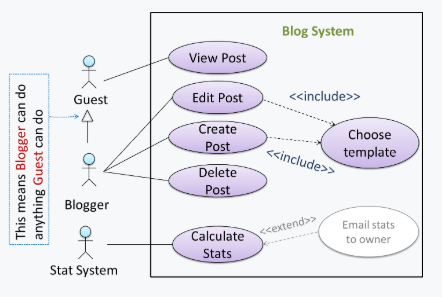

# CS2103 Notes Week 7

# Week 6 (Lecture - 20/9)

* iP
    - Asymmetric graphics for conversation
    - Since its not really a conversation between 2 people (echoing etc)
* Textual Use Cases
    - _Actor_
    - _Main success scenario_ (steps)
    - _Inclusion_
        - Underline
    - _Extensions_ 
        - E.g. extension to Step 3., as Step 3a.
* Visual Use Cases
    - Actor _generalisation_
        - Something like inheritance
    - Notation for _inclusion_: `--<<include>>-->`
    - Notation for _extension_: `--<<extend>>-->`
        - Not recommended to include
        - Too many to include
* Format
    - Vision
    - Scope
    - User
    - Workflow (broad summary of what each user does)
* API
    - Application Programming Interface
    - As long have a bunch of methods that can call
    - E.g. Application: GitHub
    - E.g. Class: `String`
    - Define APIs systematically to match features
        - Work backwards from features
* Agile Design Approach
    - Start with a minimal high-level design and evolve iteratively as necessary
    - Opposite: full design upfront
    - Because things change, just work on the things that need to be done
    - Decide only when you need a feature
* Design Fundamentals
    1. Abstraction
        - _"Abstraction is broken/leaking"_: Things that are meant to be hidden aren't
    2. Coupling
        - i.e. dependency
        - When
            - If change one class, might need a change in another class
            - If both classes assess the same global variable (not immediately obvious)
                - E.g. When modify content such that other class which uses it no longer works
        - Strong and weak dependency
        - Try to reduce
    3. Cohesion
        - About how tight something is, in a component
        - Increased cohesion, usually leads to better reusability
* Continuous Integration
    - Early and frequent integration, incrementally
    - Order of integration
        - Top-down, bottom-up (use drivers), sandwich (do both and meet halfway)
* Project
    - Build automation (Gradle)
    - Continuous integration (Travis)
    - Continuous deployment (builds a `jar` file every time it releases)
* Buffers
    - Not _padding_ (i.e. allocate more time to task)
    - If task not done by deadline, know that wrongly estimate time
* Forking workflow
    - Add a branch when adding something

# Requirements: Use Cases

* Describes an interaction between the user and te system for a specific functionality of the system
* Capture functional requirements of a system
-----
* Overview (**Textual form**)
<!-- -->

    System:
    Use case:
    Actor:
    Preconditions:
    Guarantees:
    MSS:
    Extensions:

-----
* Description of a set of sequences of actions
    - includes variants
* About actions that a system performs to yield an observable result of value to an actor
* Example:
    - _Check account balance_ use case for an ATM
<!-- -->
    System: ATM
    Actor: Customer
    Use Case: Check account balance
        1. User inserts an ATM card
        2. ATM prompts for PIN
        3. User enters PIN
        4. ATM prompts for withdrawal amount
        5. User enters the amount
        6. ATM ejects the ATM card and issues cash
        7. User collects the card and the cash.

* Use case diagrams illustrate use cases of a system visually
    - Provides a visual 'table of contents' of use cases of system
    - _Stick figures_: user roles relevant to use case
    - _Ovals_: use cases
    - Example:

    

* Use case is an interaction between a system and its _actors_
* _Actor_
    - Role played by user
    - Reside outside the system
    - can be involved in many use cases
    - A single person/system can play many roles
    - Many persons/systems can play a single role
* A use case can
    - involve many actors
    - be specified at various levels of detail
    - E.g. `conduct a survey` > `take the survey` > `answer survey question`
* Tip while modeling user-system interactions
    - Start with high level use cases and progressively work toward lower level use cases
    - Be mindful at which level of details you are working on
    - Careful not to mix use cases of different levels
-----
* **Writing use case steps**
* Main body
    - Sequence of steps that describes the interaction between system and actors
    - Each step is given as a simple statement describing _who does what_
* Describe only the **externally visible** behaviour
    - Not internal details of system
    - Should minimise details that are not part of the interaction between user and system
* A step gives the intention of the actor
    - Not the mechanics
    - Usually omit UI details
* Use case description can show loops too
    - E.g. `Steps 5-9 are repeated for each Player, and for as many rounds as required until a Player reaches the 100th square`
* **Main Success Scenario (MSS)**
    - Describes most straightforward interaction for a given use case
    - Assumes that nothing goes wrong
        - E.g. all entered details correct
        - Ignore all problems
            - E.g. timeouts, network outages etc.
    - Also known as _Basic Course of Action_, _Main flow of Events_
* **_Extensions_**
    - "Add-on"s to the MSS that describe _exceptional_/_alternative_ flow of events
    - Describe variables of scenario if certain things are not as expected by MSS
    - Written notation: Appear below MSS (separate paragraph, keep MSS **self-contained**)
    - Numbering style not a universal rule but widely used convention
        - Extensions that only happen after a step of the MSS (E.g. `3a.`, `3b.`)
        - Extensions that can happen at any step (E.g.`*a.`)
    - Don't mention events likes power failures, system crashes as extensions because system cannot function beyond catastrophic failures
    - Diagram Notation: `<<extend>>` dashed arrows
        - Direction of arrow from extension to use case it extends
        - Extension Use Case Diagram Example:

        

        - Extention Use Case Example:
<!-- -->
    System: Online Banking System (OBS)
    Use case: UC23 - Transfer Money
    Actor: User
    MSS:
        User chooses to transfer money.
        OBS requests for details of the transfer.
        User enters the requested details.
        OBS requests for confirmation.
        OBS transfers the money and displays the new account    balance.
    Use case ends.

    Extensions:
        3a. OBS detects an error in the entered data.
            3a1. OBS requests for the correct data.
            3a2. User enters new data.
        Steps 3a1-3a2 are repeated until the data entered are correct.
        Use case resumes from step 4.

    3b. User requests to effect the transfer in a future date.
        3b1. OBS requests for confirmation.
        3b2. User confirms future transfer.
        Use case ends.

    *a. At any time, User chooses to cancel the transfer.
        *a1. OBS requests to confirm the cancellation.
        *a2. User confirms the cancellation.
        Use case ends.

    *b. At any time, 120 seconds lapse without any input from the   User.
        *b1. OBS cancels the transfer.
        *b2. OBS informs the User of the cancellation.
        // Okay to have multiple times of this
        // Okay to have multiple exit points for a use case
        Use case ends.

* Use case can **include** another use case
    - Useful when
        - Don't want to clutter a use case with too many low-level steps
        - A set of steps is repeated in multiple use cases
    - Diagram Notation: `<<include>>` dotted arrow
        - From use case that includes to use case that is being included (note opposite from `<<extend>>`)

            

    - Written notation: Underlined text

* **Preconditions**
    - Specify the specific state we expect the system to be in before use case starts
    - E.g. `Preconditions: User is logged in`
    - Example:
<!-- -->
    Software System: Online Banking System
    Use case: UC23 - Transfer Money
    Actor: User
    Preconditions: User is logged in
    MSS:

        User chooses to transfer money.
        OBS requests for details for the transfer.
        ...

* **Guarantees**
    - Specify what the use case promises to give us at the end of its operation
    - Like a postcondition
    - Optional
<!-- -->
    Software System: Online Banking System
    Use case: UC23 - Transfer Money
    Actor: User
    Preconditions: User is logged in.
    Guarantees:

        * Money will be deducted from the source account only if the  transfer to the destination account is successful
        * The transfer will not result in the account balance going   below the minimum balance required.
    
    MSS:

    1. User chooses to transfer money.
    2. OBS requests for details for the transfer.
        ...

* Can use actor generalisation in use case diagrams
    - Any child actor can do what a parent actor can do
    - Notation: arrow
        - Points from child actor to parent actor
        - Like UML notation for inheritance

        
* Tip: don't over-complicate use case diagrams
    - Don't try to include everything possible
    - Use case diagram is a brief summary of the use cases that is used as a starting point
    - Details of use cases given in use case descriptions
* Can include `System` as an actor
    - Indicate that something is done by system itself without being initiated by a user/external system
    - E.g. system generates daily reports at midnight
    - but **not recommended**
    - Limit use cases for modeling behaviours that involve external actor
* UML not very specific about the text contents of a use case
    - Many styles for writing
    - Steps should be written as a continuous paragraph
    - Should be easy to read
* Advantages
    - Document system requirements as use cases
    - Use simple notation, plain English; easy for users to understand and give feedback
    - Decouple user intention from mechanism; system designers (UI-specific details) more freedom to optimise how a functionality is provided to a user
    - Identify all possible extensions encourages us to consider all situations that a software product might face during its operation
    - Separate typical scenarios from special cases/exceptional usage scenarios; encourages us to optimise typical scenarios
* Disadvantages
    - Not good for capturing requirements that do not involve a user interacting with system
    - Not suitable for capturing non-functional requirements
    - Use cases should not be the sole means to specify requirements

# Design Principles: Basic

## Abstraction

* Technique for deadling with complexity
* Establish a level of complexity we are interested in, suppress more complex details below that level
* Guiding principle of abstraction
    - Only details that are relevant to current perspective or task at hand are considered
* **Data abstraction**
    - Abstract away lower level data items and thinking in terms of bigger entities
    - E.g. _user_ data type instead of _name_, _date of birth_
* **Control abstraction**
    - Abstract away details of actual control flow to focus on tasks at a higher level
* Can be repeatedly applied to obtain progressively _higher_ levels of abstraction
    - data item > array > bit
* General concept that is not limited to just data or control abstractions
    - E.g. class > data/behaviours, architecture > design of software, models

## Coupling

* Measure of **degree of dependence** between components, classes, methods etc
* Low coupling
    - Indicates a component is less dependent on other components
* High coupling
    - AKA _tight_ coupling, _strong_ coupling
    - Discouraged
    - Maintenance harder
        - Change in one module can cause changes in other modules coupled to it (i.e. ripple effect)
    - Integration harder
        - Multiple components coupled with each other have to be integrated at the same time
    - Testing and reuse of the module is harder
        - Because of dependence on other modules
* Question 1:

* Link between regressions and coupling
    - When system is highly-coupled, risk of regressions is higher too
    - So automated regression testing is important
* Relationship between coupling and testability
    - Coupling decreases testability
    - If SUT is coupled to many other components, it becomes difficult to test the SUI in isolation of its dependencies
    - Need more drivers and stubs when integrating incrementally
-----
* X is _coupled_ to Y
    - i.e. a change to Y can _potentially_ require a change in X
    - Examples:
        - Change of method signature
        - A has access to internal structure of B
        - A and B depend on same global variable
        - A calls B
        - A receives an object of B as a parameter or a return value
        - A inherits from B
        - A and B required to follow same data format or communication protocol
-----
* Types of coupling
    1. Content coupling
        - One module modifies or relies on internal workings of another module
        - E.g. accessing local data of another module
    2. Command/global coupling
        - Two modules share the same global data
    3. Control coupling
        - One modules controlling the flow of another, by passing it information on what to do
        - E.g. passing a flag
    4. Data coupling
        - One module sharing data with another module
        - E.g. Via passing parameters
    5. External coupling
        - Two modules share an externally imposed convention
        - E.g. data formats, communication protocols, device interfaces
    6. Subclass coupling
        - A class inherits from another class
        - Note that child class is coupled to parent class but not the other way round
    7. Temporal coupling
        - Two actions are bundled together just because they happen to occur at the same time
        - E.g. extracting a contiguous block of code as a method although the code block contains statements unrelated to each other

## Cohesion

* Measure of how strongly-related and focused the various responsibilities of a component are
* Highly-cohesive component
    - Keeps related functionalities together
    - Keeps out all other unrelated things
* Higher cohesion better
* Disadvantages of low/weak cohesion
    - Lowers the _understandability_ of modules as it is difficult to express module functionalities at a higher level
    - Lowers _maintainability_ because a module can be modified due to unrelated causes (reason: module contains code unrelated to each other) OR many modules need to be modified to achieve a small change in behaviour (reason: code related to change is not localised to a single module)
    - Lowers _reusability_ because they do not represent logical units of functionality
* Examples of cohesion
    - Present in many forms
    - Code related to a single concept is kept together (component that handles everything related to a specific data type)
    - Code that is invoked close togther in time is kept together (e.g. all code related to initialising the system is kept together)
    - Code that manipulates same data structure is kept together (e.g. component that handles everything related to storage, retrieval of logs) 

# Basic Design Approaches

* Multi-level design
* Full upfront design
* Which design to use depends on situtation
* Top-down Design
    - Design the high-level design first
    - Flesh out lower levels later
    - Useful when designing big and novel systems
    - Used when high-level design needs to be stable before lower levels can be desgined
* Bottom-up Design
    - Design lower level components first
    - Put them together to create higher-level systems later
    - Usually not scalable for bigger systems
    - Used when designing variations of an existing system, or, re-purposing existing components to build a new system (i.e. a lot of existing component to be reused)
* Mix Design
    - Mix of top-down, bottom-up design
* Agile Design
    - Emergent, not defined up front
    - Overall system design will emerge over time, evolve to fulfill new requirements, take advantage of new tech as appropriate (i.e. expects design to change over product's lifetime, architecture expected to remain relatively stable)
    - Do some initial architectual modeling at the beginning to get team going
    - No fully documented set of models in place before coding starts

# IDE: Intermediate Features

* Productivity shortcuts
* Reference shortcut helpsheet

# Integration Approaches

# Project Management: Scheduling and Tracking

# Project Management: Workflows

 