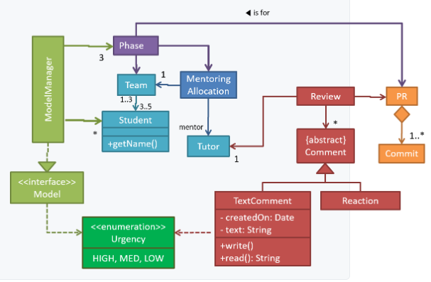
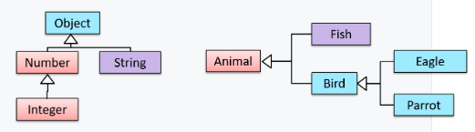
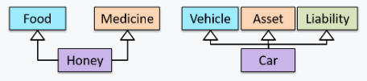
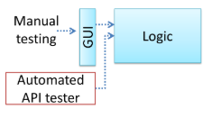
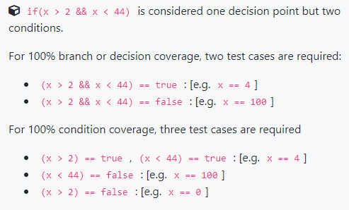

# CS2103 Notes (Week 8)

# Week 7 Lecture (4/10)
 
* Dependency injection
    - Pass in a stub
* Stubs should minimise logic
* Different kind of stubs
    - Stubs that throws errors for all methods
    - Stubs that will always reject
    - Stubs that always
* Can create stubs to inherit from another stub
* Pure unit and integration testing
    - First test the unit that does not depend on anything
    - Create stub and test unit that has dependencies
    - Then integrate test both (units that depend and are depended upon)
* Pure unit testing
    - Many test cases
* Acceptance testing 
    - by user
    - in deployment env
    - requirements specification
        - needs of the users
        - created by the business analysts, designers
* System testing
    - by QA
    - on test bed
    - system specification
        - features of the system
    - done by engineers, designers
* Flow
    - Unit test with stubs
    - Integration test whenever finish testing 2 unit tests
    - System test
    - Acceptance test
* Test-Driven Development (TDD)
    - Write test even before writing code
    - Write code just enough for code to pass
* Important points below
* Testability
    - How easy is it to test our code?
* Test coverage
    - How good are your tests?
    - How much of the code is covered by tests?
* Remember to test GUI well, when doing it manually
* Paths

-----

# Week 8 Topics

# Drawing Class/Object Diagrams

* Class Diagrams
    - Class-level members
    - Associations
        1. Labels
        2. Roles
        3. Multiplicity
        4. Navigability
    - Composition
    - Aggregation
    - Enumerations
    - Abstract classes
    - Interfaces
    - Association classes
* Object Diagrams
    - Objects
    - Associations
* Other
    - Notes
    - Constraints
    - Associations as attributes
-----

## Class Diagrams

* UML _class diagrams_ describe structure (not behaviour) of an OOP solution
* Example:

### Inheritance

* OOP concept: allows you define a new class based on an existing class
* No need to duplicate data/behaviour that are already in the _base class_, can inherit attributes and methods
* **Base class**: _Parent_ class, _Super_ class
* **Derived class**: _Child_ class, _Sub_ class, _Extended_ class
* Superclass is _more general_ than subclass
    - Subclass _more specialised_ than superclass
* Apply inheritance on a group of similar classes
    - Common parts among classes can be extracted in more **general classes**
    - Contains code common to all the classes
* Inheritance implies the derived class can be considered as a _sub-type_ of base class
    - Base class is a _super-type_ of derived class
    - Results in an **_is-a_** relationship
    - Changes to the superclass will affect its subclasses
* Does not necessarily mean a sub-type relationship exists
    - Though often hand-in-hand
* Inheritance _hierarchies_
    - AKA, Inheritance _trees_
    - Inheritance relationships through a chain of classes
    - _Ancestor classes_: Class above a class in the inheritance hierarchy
    - Example 1 and 2
        - (note: `Parrot` is a `Bird` as well as an `Animal`)

    

* _Multiple inheritance_
    - When class inherits _directly_ from multiple classes
    - Allowed in languages like Python, C++
    - Not allowed in languages like Java, C#
    - Example 1 and 2

    

-----

# Drawing Sequence Diagrams

* Basic Notation
* Loops
* Object Creation
* Minimal Notation
* Object Deletion
* Self-invocation
* Alternative Paths
* Optional Paths
* Reference Frames
* Parallel Paths

-----

# Testing: Types

* Different types of testing, different aspects/performance of software to check
* 4 + (2) types 

## 1. Integration Testing

* Definition: testing whether different parts of the software work together (i.e. integrates) as expected
* Aim to discover bugs in the 'glue code', related to how components interact with each other
    - Bugs often the result of misunderstanding of what the parts are supposed to do _vs_ what the parts are actually doing
    - E.g. Assumptions: class `Car` assume class `Wheel` can support 200 mph but actually its only 150 mph
* How: not simply a case of repeating the unit test cases using actual dependencies (i.e. no longer using stubs)
    - integration tests are **additional test cases** that **focus on the interactions between the parts**
* Flow of **pure** integration tests:
    - Example: class `car` uses classes `Engine` and `Wheel`
    1. Unit test classes that have no dependencies
        - Unit test `Engine` and `Wheel`
    2. Unit test classes that have dependencies, use stubs in place of classes depended on
        - Unit test `Car` in isolation of `Engine` and `Wheel`, using stubs for them
    3. Integration test all classes
        - Do an integration test for `Car`, using it together with classes `Engine` and `Wheel` to ensure `Car` integrates properly with them
* **In practice,** developers often use a hybrid of *unit + integration* tests to minimise the need for stubs
* Flow of **hybrid** integration tests:
    - Example: _(same as above)_
    1. Unit test classes that have no dependencies _(same)_
        - Unit test `Engine` and `Wheel`
    2. Do an integration test for all classes
        - Do an integration test for `Car`, using it together with classes `Engine` and `Wheel` to ensure that `Car` integrates properly with them
        - **Include in test cases that are meant to test the unit `Car` (i.e. test cases in above part 2 of pure workflow)** 
        - Also include test cases testing the integration of `Car` with `Wheel` and `Engine` (i.e. test cases in above part 3 of pure workflow)
    - No longer need stubs for depended classes
        - Example: `Engine` and `Wheel`
    - Downside: Class with dependencies never tested in isolation of its dependencies
        - Example: `Car`
    - Good: risk of bugs in dependency classes affecting the class depending on them is minimal, since they are already unit tested

## 2. System Testing

* **Definition:** take the whole system and test it against the system specification
*  Typically done by a testing team (i.e. QA team)
* System test cases based on the specified external behaviour of the system
    - Sometimes, they go beyond the bounds defined in the specification
    - Useful when testing that the system fails 'gracefully' having pushed beyond its limits
    - E.g. Browser can only handle up to 5000 char, if beyond that, abort loading the page and show a meaning error message (considered fail if browser attempts to load anyway and crashes)
* System test cases also test against non-functional requirements
    - Examples:
    - _Performance testing_
        - Ensure that system responds quickly
    - _Load testing_/_Stress testing_/_Scalability testing_
        - Ensure the system can work under a heavy load
    - _Security testing_
        - Test how secure the system is
    - _Compatibility testing_/_Interoperability testing_
        - Check whether the system can work with other systems
    - _Usability testing_
        - Test how easy it is to use the system
    - _Portability testing_
        - Test whether the system works on different platforms

-----

### Automated Testing of GUIs

* If software product has a GUI component, all product-level testing needs to be done using GUI
* Testing GUI is much harder than CLI
    - Most GUI can support a large number of different operations (usually performed in any arbitrary order)
    - GUI operations more difficult to automate than API testing
    - Hard to automatically verify whether the GUI behaves as expected (cannot compare return value with expected value)
    - Automated regression testing of GUIs difficult
    - Appearance of GUI (and sometimes behaviour) can be different across platforms, environments
        - Minimise, maximised window
        - In focus, out of focus
        - High, low resolution display 

    

* How to make GUI testing easier
    - **Move as much logic as possible out of GUI**
    - Bypass GUI, testing rest of system using automated API testing
    - Reduce number of manual testing of GUI
* Testing tools that automate GUI testing
    - TestFx: automated testing of JavaFx GUIs
    - VisualStudio: supports 'record replay' type of GUI test automation
    - Selenium: can automate testing of Web application UIs

-----

## 3. Acceptance Testing

* **Definition:** Acceptance testing/User Acceptance Testing (UAT) tests the system to ensure it meets the user requirements
* Assures customers that the system is doing what it is intended to do
* Often defined at the beginning of the project, usually based on the use case specification
* Successful completion of UAT often a prerequisite to project sign-off
* Involves testing the whole system
    - Similar to system testing

-----

## System _vs_ Acceptance Testing

|| System Testing | Acceptance Testing |
| --- | --- | --- |
| Done against | system specification | requirements specification|
| Done by | testers of the project team | team that represents the customer |
| Done on | development environment or a test bed | deployment site or on a close simulation of deployment site |
| Type of test cases | Both negative (i.e. SUT is not expected to work normally, e.g. incorrect inputs) and positive (i.e. SUT is expected to work normally), (i.e. assertFalse, assertTrue, assertThrows) | More focus on positive test cases |
| Usually more extensive than acceptance testing | |
| Can include testing for non-functional requirements | |

| System Specification | Requirements Specification |
| --- | --- |
| Can include details on how it will fail gracefully when pushed beyond limits, how to recover | Limited to how system behaves in normal working conditions |
| Written in terms of how the system solves those problems | Written in terms of problems that need to be solved |
| (Example: explain the email search feature) | (Example: Provide a method to locate an email quickly) |
| Could contain additional APIs not available for end-users (for use of developers/testings) | Specifies the interface available for intended end-users |

* **In many cases, one document serves as both a system and requirement specification**

* **Passing system test does not mean passing acceptance testing**
    - Example: System might work on testbed environment but might not work the same way in deployment environment, because subtle differences between 2 environments
    - Example: system might fail to solve the problem it was supposed to solve for the user, because flaws in system design
* In smaller projects, developers may do system testing, in addition to developer testing

-----

## 4. Alpha/Beta Testing

* Definition (**_Alpha testing_**): **Performed by the users, under controlled conditions set by the software development team**
    - Like user testing of UI, give scenarios (?)
* Definition (**_Beta testing_**): **Performed by a selected subset of target users of the system in their natural work setting**
    - Like really using it in actual workflow (?)
* _Open beta release_
    - Release of not-yet-production-quality-but-almost-there software to general population

## 5./6. Exploratory vs Scripted Testing

* 2 alternative approaches to testing a software
    1. _Scripted_ testing
        - First, write a set of test cases based on expected behaviour of SUT (i.e. test cases predetermined)
        - Then, perform testing based on that set of test cases
    2. _Exploratory_ testing
        - Devise test cases on-the-fly
        - Create new test cases based on the results of past test cases
* Exploratory testing
    - Also known as _reactive testing, error guessing technique, attack-based testing, bug hunting_
    - Simultaneous learning, test design and test execution
    - Nature of follow-up test case decided based behaviour of previous test cases
    - i.e. Running the system and trying out various operations
    - Usually starts with areas identified as error-prone, based on tester's past experience with similar systems
    - Tends to conduct more tests for operations where more faults are found

* **A mix of both approaches is better** than just relying on one approach

|| Scripted Testing | Exploratory Testing |
| --- | --- | --- |
| Good | More systematic, likely to discover more bugs given sufficient time | Quick system recovery, especially if tester has a lot of experience in testing similar systems |
| | | Can detect some problems in a relatively short time (though not prudent to use as sole means of testing a critical system, as explained below) |
| Bad | | Success depends on tester's prior experience and intuition |
| | | Should be done by experienced testers, using a clear strategy/plan/framework |
| | | Ad-hoc exploratory testing by unskilled/inexperienced testers without a clear strategy not recommended for real-world non-trivial problems |

-----

# Testing: Intermediate Concepts

## Dependency Injection

* Definition: **process of 'injecting' objects to replace current dependencies with a different object**
* Often used to inject stubs to isolate SUT from its dependencies (i.e. objects it depends on), to test SUT in isolation
* How to implement: polymorphism
    - substitute an existing dependency with another
    - substitute to other component with test-friendly stubs
* Example:
<!-- -->
    // Unit test Payroll#totalSalary()
    class Payroll {
        private SalaryManager manager = new SalaryManager();
        private String[] employees;

        void setEmployees(String[] employees) {
            this.employees = employees;
        }

        void setSalaryManager(SalaryManager sm) {
        this. manager = sm;
        }

        double totalSalary() {
            double total = 0;
            for(int i = 0;i < employees.length; i++){
                total += manager.getSalaryForEmployee(employees[i]);
            }
            return total;
        }
    }

    class SalaryManager {
        double getSalaryForEmployee(String empID){
            //code to access employee’s salary history
            //code to calculate total salary paid and return it
        }
    }

    // Inject a `SalaryManagerStub` object to replace current `SalaryManager` object
    class PayrollTest {
        public static void main(String[] args) {
            //test setup
            Payroll p = new Payroll();
            p.setSalaryManager(new SalaryManagerStub()); //dependency injection
            //test case 1
            p.setEmployees(new String[]{"E001", "E002"});
            assertEquals(2500.0, p.totalSalary());
            //test case 2
            p.setEmployees(new String[]{"E001"});
            assertEquals(1000.0, p.totalSalary());
            //more tests ...
        }
    }

    class SalaryManagerStub extends SalaryManager {
        /** Returns hard coded values used for testing */
        double getSalaryForEmployee(String empID) {
            if(empID.equals("E001")) {
                return 1000.0;
            } else if(empID.equals("E002")) {
                return 1500.0;
            } else {
                throw new Error("unknown id");
            }
        }
    }

## Testability and Test Coverage

* An indication of how easy it is to test an SUT
* Depends alot on design and implementation
* Should try to increase it
    - The higher the testability, the easier it is to achieve a better quality software
* **Test coverage**
    - Metric used to measure extent to which testing exercises code
    - i.e. how much code is 'covered' by the tests
* Coverage criterions
    1. **Function/method coverage**
        - Based on functions executed
        - Proportion of functions covered in testing
        - E.g. testing executed 90 out of 100 functions
    2. **Statement coverage**
        - Based on the number of lines of code executed
        - Proportion of lines of code executed during testing
        - E.g. testing executed 23k out of 25k LOC
    3. **Decision/branch coverage**
        - Based on the decision points exercised
        - Proportion of alternate and optional paths executed during testing
        - E.g. an `if` statement evaluating to both `true` and `false` with separate test cases during testing is considered 'covered'
    4. **Condition coverage**
        - Based on the boolean sub-expressions
        - Each evaluated to both true and false with different test cases
            1. evaluate to `true`
            2. evaluate to `false`
        - **NOT** the same as decision coverage
    
    

    5. **Path coverage**
        - Measures coverage in terms of possible paths through a given part of the code executed
        - _100% path coverage_ means all possible paths have been executed
        - _Control Flow Graph (CFG)_ : Commonly used notation for path analysis
        - **Gives the highest intensity of testing**
            - _100% path coverage_ implies all possible execution paths through SUT have been tested
            - 'exhaustive testing'
            - Hard to achieve for a non-trivial SUT
            - If all tests pass at 100% path coverage, SUT code can be considered 'bug free'
        - Note: does not include paths that are missing from the code all together because the programmer left them out by mistake
    6. **Entry/exit coverage**
        - Measures coverage in terms of possible _calls to_ and _exits_ from operations in SUT
* _Coverage analysis tools_
    - Measure coverage
    - Most IDEs have inbuilt support/plugins for measuring test coverage
* Coverage analysis can be useful in improving the quality of testing
    - E.g. if set of test cases don't achieve 100& branch coverage, more test cases can be added to cover missed branches

## Test-Driven Development (TDD)

* Advocates the writing of tests before writing the SUT, while evolving the functionality and tests in small increments
* Workflow:
    1. First, define the precise behaviour of SUT using test cases (but not _all_)
    2. Then, write the SUT to match the specified behaviour
    - Proceed in small steps, write tests and functional code in tandem, but write test before corresponding functional code
* Many consider it a way to reduce defects
* One big advantage
    - Guarantees the code is testable
* JUnit can be used for TDD but not necessarily so