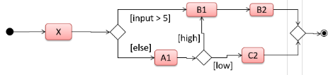
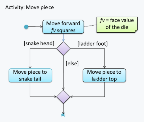
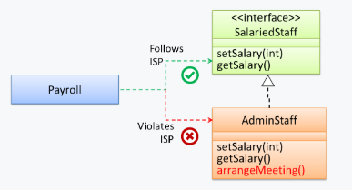

# CS2103 Notes (Week 9)

# Week 8 (Lecture - 11/10)

* Activity diagram
    - **Fork**
        - Indicates parallel paths
    - **Branch**
        - Only can have 2 paths from a branch
    - **Rakes**
        - Non-examinable
    - **Swim lanes**
        - Non-examinable
        - Add-on
        - Show _who_ is only doing what actions
* Open-Closed Principle (OCP)
    - Open for extension: Should be able to extend (use the same code and add-on to it) and use it
    - Closed for modification: should not modify the code itself
        - Because other things coupled to it might be affected by changes in code
* Liskov Substitution Principle
    - Must be substitutable for base classes
    - If parent class has some restrictions (e.g. can only accept number from 1 to 100)
    - Child class should **not** be more restrictive than the parent (e.g. can only accept number from 1 to 10)
* Law of Demeter
    - E.g. `//B` is not good because `Seller` should not know that the money is in the `Wallet` (money could be somewhere else)
    - Should be hidden within `getPayment()`
<!-- -->
    class Seller {
        void getPayment(Customer c, double amount) {
            // A
            Money payment = c.getPayment(amount);
            // B
            Money payment = c.getWallet().getPayment(amount);
        }
    }

-----

* **Sequential/Waterfall**
    - One phase produces something that leads/allows the start of the next phase
    - Initially buggy
        - E.g. box not stable
    - If requirements are well-understood, fixed and effort predictable
    - Especially if there is a high cost of deploying a 95% completed product
        - E.g. space shuttle 
* **Iterative**
    - If requirements fuzzy and evolving
    1. Iterative (breadth-first)
        - Product appears very fast
        - Initialise all components first
    2. Iterative (depth-first)
        - Appears component by 

------

* Agile processes
    - **NOT** 'high ceremony' processes (i.e. not heavy-weight)
    - E.g. XP (Extreme Programming), Scrum
* Scrum
    - Choose tasks to do in backlog
    - Complete in a sprint/iteration
        - Produce a potential product
    - Regulates the project
        - Pause and take stock
* Types of Documentation
    1. Tutorials
        - Teaching newcomer how to use app
    2. How-to Guides
        - Series of steps on achieving/completing a specific task
    3. Explanation
        - Helps to understand context, background, reasons
    4. Reference
        - Lots of information, describes structure, accurate, complete
    - Minimise (as much as necessary)
    - Top-down explaining
    - Docs from code, not writing it yourself (better chance of being updated)
    - UML Diagrams mainly used for communication
        - Don't expend unnecessary effort
    - Document only stable things
    - Comprehensible for guides
    - Comprehensive for references
    - Remember the purpose
        - tP: for explaining, communication, to be judged by reader, convey message
        - Adjust effort accordingly
        - Include several _types_ of diagrams
            - *What you could have done (possible alternative), explain with a different diagram

-----

# Object Oriented Domain Models (OO Domain Models)

* AKA **_conceptual class diagrams_** or **_OO domain models (OODMs)_**
* **Definition**: class diagrams which are used to model problem domain
    - analysis process of identifying objects and object classes
* Use class diagrams to model objects in _problem domain_ 
    - i.e. relevant information that is needed to analyse a problem
    - i.e. model how objects actually interact in real world before emulation in solution)
    - _vs_ class diagram (describe solution domain)
* OODMs do not contain solution-specific classes
    - i.e. classes that are used in the solution domain but don't exist in the problem domain
    - Example:
        - class `DatabaseConnection` in class diagram but not usually in OO domain model
        - Because `DatabaseConnection` is something related to a software solution but not an entity in the problem domain
* OODMs represent the _class structure_ of the problem domain
    - Not behaviour (shown by sequence diagrams)
* OODM notation is similar to class diagram notation
    - but typically omit methods and navigability (i.e. arrows)
* Examples: OO domain model of a snakes and ladders game
    - **Description**: Snakes and ladders game is played by two or more players using a board and a die. The board has 100 squares marked 1 to 100. Each player owns one piece. Players take turns to throw the die and advance their piece by the number of squares they earned from the die throw. The board has a number of snakes. If a player’s piece lands on a square with a snake head, the piece is automatically moved to the square containing the snake’s tail. Similarly, a piece can automatically move from a ladder foot to the ladder top. The player whose piece is the first to reach the 100th square wins.

    

# Activity Diagrams

* Software projects often involve _workflows_
    - Define the flow in which a process or a set of tasks is executed
    - Understanding workflow is important for success of software project
* Examples where workflow relevant to software project
    1. Software automates work of an insurance company
        - Takes into account workflow of processing an insurance claim
    2. Algorithm of a price of code represents the execution flow (i.e. workflow) of the code
* **UML _activity diagrams_ (AD)**
    - Model workflows
    - UML equivalent of flow charts
* Example:

    

* **Linear Paths**
    - AD captures an _activity of actions and control flows_ that make up the activity
    1. _action_
        - Single step in an activity
        - Notation: rectangle with **rounded corners**
        - Examples: `take to cashier`, `put back`, `buy`
    2. _control flow_
        - Shows flow of control from one action to the next
        - Notation: line with **arrow-head** to show direction of flow
        - There cannot be any double-headed arrows
    3. _start, end node_
        - Represents the start and end of an activity, respectively
        - **Note** difference between the nodes
    - Notation example:

    
    
    - An activity can have only one action (i.e. one rounded-corner rectangle)

* **Alternate Paths**
    - _branch node_
        - Shows start of alternate paths
            - There can be more than 2 alternate paths
            - An alternate path can divide into more branches
            - A branch can join other branches

            
            
            - A branch can form a loop by going back to the original branch node
            
            
        
        - _guard condition_
            - Each control flow exiting branch node has one
            - A boolean condition that should be true for execution to take that path
            - Only one guard condition can be true at any time
            - Notation: **square brackets**
            - Examples: `[Customer likes product]`, `[else]`
    - _merge node_
        - Shows end of alternate paths
    - Notation: diamond shape
    - Notation example:

    

* **Parallel Paths**
    - _fork nodes_
        - Indicate the start of concurrent flows of control
    - _join nodes_
        - Indicate end of parallel paths
    - Notation: a horizontal bar
    - In a set of parallel paths (i.e. paths with matching fork-join pair), execution along all parallel paths should be complete before execution can start on the outgoing control of _join_
        - i.e. Both parallel path of activities needs to finish before any activity after _join node_ can take place
        - i.e. All parallel paths that started from a fork should end in the **same** join node
    - -A parallel path can have multiple actions
    - Notation example:

    

* **Rakes**
    - Indicate that a part of the activity is given as a separate diagram
        - i.e. Action is described in another subsidiary activity diagram elsewhere
    - Notation: _rake symbol_ in an _action_ rectangle
    - Example:

    
    

* **Swim Lanes**
    - _Swimlane diagrams_ are partitioned activity diagrams
    - Partition an activity diagram to show who is doing what action
    - Example:

    

-----

# Design Principles

1. Single Responsibility Principle (SRP)
    - A class has one and only one reason to change
    - Class has only one responsibility, needs to change only when there is a change to that responsibility
    - Gather together things that change for the same reasons
    - **Bad** Example:
        - `TextUi` class does parsing of user commands, interacts with user
        - Class needs to change when formatting of UI changes, syntax of user command changes
        - Not following SRP

2. Open-Closed Principle (OCP)
    - A module should be _open_ for extension for _closed_ for modification
    - Modules should be written so that they can be extended, without requiring them to be modified
    - **Should be able to change a software's module's behaviour without modifying its code**
    - Aims to make a code entity easy to adapt and reusable without needing to modify the code entity itself
    - Achieved through, separating _specification/interface_ from its _implementation_
    - Example 1:
        - Behaviour of `CommandQueue` class can be altered by adding more concrete `Command` subclasses
        - If add `Delete` class to delete commands, no need to modify code (just add alongside `List`, `Sort`, `Reset`)
        - Hence behaviour of `CommandQueue` was extended without having to modify its code
    - Example 2:
        - Alter behaviour of Java generic class by passing it a different class as a parameter
        - `ArrayList` class behaves as a container of `Students`, and a container of `Admin` objects
        - 2 containers, no need to change code
        - Behaviour of `ArrayList` extended

3. Separation of Concerns Principle (SoC)*
    - To achieve better modularity, separate code into distinct sections, such that each section addresses a separate _concern_
    - _Concern_
        - A **set of information** that affects the **code of a computer program**
        - Examples:
            - A specific feature, such as code related to `add employee` feature
            - A specific aspect, such as code related to `persistence` or `security`
            - A specific entity, such as code related to `Employee` entity
    - Should lead to higher cohesion, lower coupling
    - Apply SoC to reduce functional overlaps among code sections and also limits the ripple effect when changes are introduced to a specific part of the system
        - A change to a class will not need changes to another class
    - SoC principle can be applied at class level, as well as on higher levels
        - _n-tier architecture_ uses SoC principle
        - AKA _multi-layered_, _layered_

        

        - Higher layers make use of services provided by lower layers
        - Examples, used in: operating systems, network communication software

        

        - Each layer in architecture has well-defined functionality, no functional overlap with each other

4. Liskov Substitution Principle (LSP)
    - Derived classes must be substitutable for their base classes
    - Goes beyond substitutability
    - **Implies that a subclass should not be more restrictive than the behaviour specified by superclass**
        - i.e. Subclass does not impose more restrictive conditions than its parent class
    - If not followed, substituting a subclass object for a superclass object than break functionality of code in Java
        - i.e. code that worked with parent class may not work with child class

5. Law of Demeter (LoD)**
    - An object should
        1. Have only limited knowledge of another object
        2. Only interact with objects that are closely related to it
    - Also known as
        - Don't talk to stranger
        - Principle of least knowledge
    - Method `m` of object `O` should invoke only methods of the following kinds of objects
        - Object `O` itself
        - Objects passed as parameters of `m`
        - Objects created/instantiated in `m` (directly/indirectly)
        - Objects from the direct association of `O` (i.e. objects held by instance variables of `O`)
    - Aims to prevent objects navigating internal structures of other objects
    - **BAD** example (violate LoD)
        - MineSweeper example
        - In `Logic` class
        - Inside `setMinefield(Minefield mf): void`
        - Has `mf.getCell(1,3).clear()`
            - Violate LoD, `Logic` is handling `Cell` objects deep inside `Minefield`
            - Should be `mf.clearCellAt(1,3)`
    - **BAD** example
        - `b` is a 'friend' of `foo` (because receives it as a parameter)
        - `g` is a 'friend of a friend' (considered as 'stranger`)
        - `g.doSomething()` (talking to a 'stranger')
<!-- -->

    void foo(Bar b) {
        Goo g = b.getGoo();
        g.doSomething();
    }

6. Interface Segregation Principle (ISP)
    - No client should be forced to depend on methods it does not use
    - Example:
        - `Payroll` class should not depend on `AdminStaff` class since it does not use `arrangeMeeting()` method
        - Should depend on `SalariedStaff` interface
<!-- -->
    public class Payroll {
        //...    
        private void adjustSalaries(AdminStaff adminStaff){ //violates ISP
            //...
        }
        private void adjustSalaries(SalariedStaff staff){ //does not violate ISP
            //...
        }    
    }

7. Dependency Inversion Principle (DIP)
    1. High-level modules should not depend on low-level modules, both should not depend on abstractions
    2. Abstractions should not depend on details, details should depend on abstractions
    - Changes the direction of dependencies, not reduce it
    - Can introduce extra abstractions, but worth it
    - Example:

    

8. SOLID Principles
    - **(S)**: Single Responsibility principle (SRP)
    - **(O)**: Open-Closed Principle (OCP)
    - **(L)**: Liskov Substitution Principle (LSP)
    - **(I)**: Interface Segregation Principle (ISP)
    - **(D)**: Dependency Inversion Principle (DIP)

9. YAGNI Principle
    - _You Aren't Gonna Need it!_ principle
    - Do not add code simply because 'you might need it in the future'
    - Should not build some capability we presume software will require in the future
    - Rationale: we do not have perfect information about the future, extra work we do to fulfill a potential future need might go to waste when some of our predictions fail to materialise

10. DRY Principle
    - _Don't Repeat Yourself_ principle
    - Every piece of knowledge must have a single, unambiguous, authoritative representation within a system
    - Guards against the duplication of information
    - Examples of violations
        - Functionality implemented twice (even if 2 implementations are different, purpose is the same)
        - Defining a value of a system-wide timeout in multiple places

11. Brooks' Law
    - Adding people to a late project will make it later
    - By Fred Books
    - Additional communication overhead will outweigh the benefit of adding extra manpower, especially if done near a deadline
    - Slow-down of project (for a short period, maybe for smaller projects)
    - New member needs time to learn the project, existing members need to spend time helping new member
    - Could delay project delivery is project is behind schedule and near a deadline

-----

# Conceptualising a Design

# SDLC Process Models

* _Software development life cycle (SDLC)_
    - A collection of different stages
    - Such as _requirement gathering_, _analysis_, _design_, _implementation_, _testing_ and _deployment_
* Several approaches, _SDLC models_/_software process models_
    - Describe different ways/"road maps" to go through SDLC, to manage development effort
    - Describes
        - the aims of development stage(s)
        - the artifacts/outcomes of each stage
        - workflow (i.e. relationship between stages)
* Basic process models
    1. Sequential/waterfall
    2. Iterative

* **Sequential Models**
    - AKA _waterfall model_
        - Taken from how model is drawn like a waterfall
    
    

    - Models software development as a **linear process**
    - Project progresses steadily in one direction through development stages
    - When one stage of process completed, it should produce some artifacts to be used in the next stage
    - Organises project based on activities
    - Higher risk than _iterative models_ of overshooting a deadline
        - _Iterative process_ allows previous version to be delivered if last iteration got delayed (but does not guarantee all featurs promised at the beginning will be delivered on deadline)
    - Good:
        - Useful model when problem statement is well-understood and stable
        - Results in timely and systemic development effort
        - Each stage has a well-defined outcome
        - Easy to track progress of project
    - Bad:
        - Requirements of a real-world project rarely understood at beginning and keeps changing over time
        - Users generally not aware of how software application can be used without prior experience in using a similar application

* **Iterative Models**
    - AKA _iterative/incremental model_
    - Goes through several iterations of SDLC, similar to several cycle of sequential model

    

    - Each iteration could potentially go through all development stages
    - **Each of the iterations produces a new version of the product**
    - Feedback on the version can be taken into account in the next iteration
    - Organises project based on functionality
        - Improve functionalities in later releases
    - 2 approaches to iterative planning
        1. **Breadth-first**
            - An iteration evolves all major components in parallel
        2. **Depth-first**
            - An iteration focuses on fleshing out only some components
        - Most projects use a mixture of breadth-firt and depth-first iterations
            - _iterative **and** incremental process_

* **Agile Models**
    - _agile manifesto_ (a vision statement of what they were looking to do)
    - Better ways of developing software by doing it and helping others to do it
    - Alternative to documentation-driven, heavyweight software development processes
    - Value items on the LHS _more_ than RHS:
        1. **Individuals and interactions** over _processes and tools_
        2. **Working software** over _comprehensive documentation_
        3. **Customer collaboration** over _contract negotiation_
        4. **Responding to change** over _following a plan*
    - Process models that follow _agile manisfesto_ (2 here)
        1. Scrum
        2. XP
    - Key features of agiles approaches
        - Requirements 
            - prioritised based on needs of user
            - clarified regularly (sometimes daily) with entire project team
            - factored into development schedule as appropriate
        - Design, project plan
            - Rough project plan (over very elaborate and detailed)
            - High level design
            - Evolves as project continues
        - Strong emphasis on complete transparency and responsibility sharing among team members
            - team responsible together for delivery of product
            - team members are accountable 
            - share progress with each other and with user regularly and openly
        
-----
## Agile Processes

1. **Scrum**
    - A process skeleton that contains sets of practices and predefined roles
    - Main roles given to people
        - **Scrum Master**
            - Maintains processes
            - In lieu of project manager
        - **Product Owner**
            - Represents the stakeholders and business
        - **Team**
            - Cross-functional group who do the actual analysis, design, implementation, testing etc
    - Structure of a Scrum project
        - Divided into iterations (called **Sprints**)
        - **Sprints**
            - A sprint is a basic unit of development
            - Tend to last between one week and one month
            - A timeboxed (i.e. restricted to a specific duration) effort of constant length
        - Each sprint **preceded by** a planning meeting
            - Identify tasks for sprint
            - Estimate commitment for sprint goal
            - Review/restrospective meeting to review progress/lessons for next sprint
        - **During** each sprint, the team creates a potentially deliverable product increment
            - Set of features delivered come from _product backlog_
            - Prioritised set of high level requirements of work to be done
            - Determine backlog items to go into sprint during sprint planning meeting
            - Product Owner informs team of backlog items he/she wants completed
            - Team determines how much of this they can complete, records it in sprint backlog
            - No one allowed to change sprint backlog during sprint (i.e. requirements frozen for that sprint)
            - Sprint must end on time
            - **On each day of sprint**
                - _Daily scrum_ is held
                - Typically same location and time each day
                - Ideally, in the morning
                - Sets context for coming day's work
                - Restricted to 15 mins (keep discussion brisk, relevant)
                - Questions each team member answers:
                    1. _What did you do yesterday?_
                    2. _What will you do today?_
                    3. _Are there any impediments in your way?_
                - Meeting not problem-solving/issue-resolution meeting
                - Issues raised are taken offline, usually dealt with by relevant subgroup immediately after meeting
        - **After** sprint
            - If requirements not completed, they are left out and returned to product backlog
            - Team demonstrates the use of the software
    - Scrum enables creation of self-organising teams by encouraging co-location of all team members
    - **Key principle**: Recognises that customers can change their minds about what they want and need during a project
        - _Requirements churn_
        - Address unpredicted challenges
        - Accept that problem cannot be fully understood/defined
        - Focus instead on maximising team's ability to deliver quickly and respond to emerging requirements

2. **XP (_eXtreme Programming_)**
    - Stresses customer satisfaction
    - Delivers software customer needs when they need it
    - Aims to empower developers to confidently respond to changing customer requirements
        - Even late in life cycle
    - Emphasises teamwork
        - Everyone equal partners in a collaborative team
        - Team self-organises around problem to solve it as efficiently as possible
    - Aims to improve software project in 5 essential ways
        1. communication
        2. simplicity
        3. feedback
        4. respect
        5. courage
    - Constantly communicate with customers, fellow programmers
    - Keep design simple and clean
    - Get feedback, test software from day one
    - Every small success deepens their respect for unique contributions of each and every team member
    - Set of simple rules
    
    

    - Some topics related to XP
        - _Pair programming_
        - _CRC cards_
        - _Project velocity_
        - _Standup meetings_

## Other processes

3. **Unified Process**
    - Developed by the Three Amigos
        - Ivar Jacobson, Grady Booch, James Rumbaugh
        - Creators of UML
    - Flexible and customisable process model framework (a process framework)
        - Rather than a single fixed process
    - Some things that can be adjusted
        - Number of iterations in each phase
        - Definition of workflows
        - Intensity of a given workflow in a given iteration
        - Adjust according to nature of project
    - Can be iterative and incremental
    - Consists of 4 phases

| Phase | Activities | Typical Artifacts |
| --- | --- | --- |
| **Inception** | - Understand the problem and requirements | - Basic use case model |
| | - Communicate with customer | - Rough project plan |
| | - Plan the development effort | - Project vision and scope |
| **Elaboration** | - Refines and expands requirements | - System architecture |
| | - Determines a high-level design (e.g. system architecture) | - Various design models |
| | | - Prototype |
| **Construction** | - Major implementation effort to support the use cases identified | - Test cases of all levels |
| | - Design models are refined and fleshed out | - System release |
| | - Testing of all levels carried out | |
| | - Multiple releases of system | |
| **Transition** | - Ready the system for actual production use | - Final system release |
| | - Familiarise end users with the system | - Instruction manual |

* Example:
    - Visualisation of a project done using Unified process
    - Only records a particular application of UP, rather than describe how UP is to be applied
        - But can be refined and reused in future similar projects
    - Each phase can consist of several iterations
    - Each vertical column represents a single iteration
    - Each iteration consists of a set of 'workflows' (i.e. y-axis)
    - Shaded region indicated amount of resources and effort spend on a particular workflow in a particular iteration

4. **Capability Maturity Model Integration (CMMI)**
    - Process improvement approach
    - Defined by Software Engineering Institute at Carnegie Melon University
    - Provides organisations with essential elements of effective processes, which will improve their performance
    - Defines 5 maturity levels for a process
    - Provides criteria to determine if the process of an organisation is at a certain maturity level

    

## Questions

1. Discuss how **sequential approach** and the **iterative approach** can affect the following aspects of a project.

    a) Quality of the final product.    
    b) Risk of overshooting the deadline.
    c) Total project cost.
    d) Customer satisfaction.
    e) Monitoring the project progress.
    f) Suitability for a school project.

2. Find out more about the following three topics and give at least three arguments for and three arguments against each.

    (a) **Agile processes**
    (b) **Pair programming**
    (c) **Test-driven development**

# Writing Developer Documents

* Technical documents to help others understand technical details
* 2 forms of Developer-to-Developer documentation
    1. for **_developer-as-user_**
        - Document how software components are to be used
        - So that other developers can reuse them
        * **1.1 API documentation**
            - APIs expose functionality in small-sized, independent and easy-to-use chunks
            - Each can be documented systematically
            - Explaining functions/methods independently
            - Useful for both developers who use API and developers who maintain API implementation
            - There are tools that can generate API documents from code comments
            - Can contain code examples
        * **1.2 Tutorial-style instructional documentation**
            - Higher-level explanations of how to use an API usefully
    2. for **_developer-as-maintainer_**
        - Document how system/component is designed, implemented and tested
        - So that other developers can maintain, evolve code
        - Need to explain complex internal details
        - Only _some_ information need to be included since developer would have access to source code
        - Complementary source of information
            - Code
            - Code comments
* 4 things needed to write good documentation
    - 4 different purposes/functions
    - 4 different approaches required

| S/N | Documentation | | Analogy |
| --- | --- | --- | --- |
| 1 | Tutorials | - Learning-oriented | **Teaching** a small child how to cook |
| | | - Allows newcomer to get started | |
| | | - Is a lesson | |
| 2 | How-To Guides | - Goal-oriented | A **recipe** in a cookery book |
| | | - Shows how to solve a specific problem | |
| | | - Is a series of steps | |
| 3 | Explanation | - Understanding-oriented | An article on culinary social history |
| | | - **Explains** | |
| | | - Provides background and context | |
| 4 | Reference guide | - Information-orientation | A reference encyclopedia article |
| | | - Describes the machinery | |
| | | - Is accurate and complete | |

## **3 Guidelines**

1. Aim for Comprehensibility
    - Readily understood
    - Not just accurate and comprehensive
    - **Use plenty of diagrams**
        - Complement words with visual illustrations
        - E.g. UML diagram
    - **Use plenty of examples**
        - When explaining algorithms, show a running example
        - Illustrate each step of algorithm, in parallel to worded explanations
    - **Use simple and direct explanations**
        - Avoid long sentences, convoluted explanations, fancy words
    - **Get rid of statements that do not add value**
        - E.g. 'We made sure our system works perfectly'
        - E.g. 'Component X has its own responsibilities'
    - **Not good to have a separate section for each type of artifact**
        - Don't have separate sections for each type of diagrams
        - **Bad examples:** `'use cases'`, `'sequence diagrams'`, `'activity diagram'` etc
        - Don't separate diagrams from words
        - Need words to justify need for diagram, explain it
        - If want to provide additional diagrams for completeness' sake, include them in appendix as reference
2. Describe Top-Down
    - Top-down **breadth-first** explanation
    - Advantages
        - Document structured like an upside down tree (root at top)
        - Reader can travel down a path he/she interested in until reaching component interested to learn in-depth
        - No need to read entire document/understand whole system
        - Example:
            -  Explain a system called `SystemFoo` with two sub-systems, `FrontEnd` and `BackEnd`
            1. Start by describing the system at the highest level of abstraction, and progressively drill down to lower level details.
            - An outline for such a description is given below:
<!-- -->
    // [First, explain what the system is, in a black-box fashion (no internal details, only the **external view**).]

    `SystemFoo` is a ...

    // [Next, explain the high-level architecture of SystemFoo, referring to its **major components** only.]

    SystemFoo consists of two major components: FrontEnd and BackEnd.

    The job of FrontEnd is to ... while the job of BackEnd is to ...

    And this is how FrontEnd and BackEnd work together ...

    // [Now we can drill down to FrontEnd's **details**.]

    FrontEnd consists of three major components: A, B, C

    A's job is to ...
    B's job is to...
    C's job is to...

    And this is how the three components work together ...

    // [At this point, further drill down the **internal workings of each component**. A reader who is not interested in knowing nitty-gritty details can skip ahead to the section on BackEnd.]

    In-depth description of A ...

    In-depth description of B ...

    // [At this point drill down details of the BackEnd.]

    ...

3. Minimal but Sufficient

    - Aim for 'just enough' developer documentation
    - Minimise overhead of writing documentation
    - Documentation should complement code, should provide only just enough guidance to get started (if readers will eventually read the code)
    - **Focus on providing higher level information that is not readily visible in code or comments**
    - Try not to duplicate chunks/text
        - E.g. describing several similar algo/design/API
    - **Describe similarity in one place, emphasise only differences in other places**
        - Indicate differences between what looks like similar text
