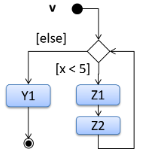

# CS2103 Notes (Week 9)

# Week 8 (Lecture - 11/10)

* Activity diagram
    - **Fork**
        - Indicates parallel paths
    - **Branch**
        - Only can have 2 paths from a branch
    - **Rakes**
        - Non-examinable
    - **Swim lanes**
        - Non-examinable
        - Add-on
        - Show _who_ is only doing what actions
* Open-Closed Principle (OCP)
    - Open for extension: Should be able to extend (use the same code and add-on to it) and use it
    - Closed for modification: should not modify the code itself
        - Because other things coupled to it might be affected by changes in code
* Liskov Substitution Principle
    - Must be substitutable for base classes
    - If parent class has some restrictions (e.g. can only accept number from 1 to 100)
    - Child class should **not** be more restrictive than the parent (e.g. can only accept number from 1 to 10)
* Law of Demeter
    - E.g. `//B` is not good because `Seller` should not know that the money is in the `Wallet` (money could be somewhere else)
    - Should be hidden within `getPayment()`
<!-- -->
    class Seller {
        void getPayment(Customer c, double amount) {
            // A
            Money payment = c.getPayment(amount);
            // B
            Money payment = c.getWallet().getPayment(amount);
        }
    }

-----

* **Sequential/Waterfall**
    - One phase produces something that leads/allows the start of the next phase
    - Initially buggy
        - E.g. box not stable
    - If requirements are well-understood, fixed and effort predictable
    - Especially if there is a high cost of deploying a 95% completed product
        - E.g. space shuttle 
* **Iterative**
    - If requirements fuzzy and evolving
    1. Iterative (breadth-first)
        - Product appears very fast
        - Initialise all components first
    2. Iterative (depth-first)
        - Appears component by 

------

* Agile processes
    - **NOT** 'high ceremony' processes (i.e. not heavy-weight)
    - E.g. XP (Extreme Programming), Scrum
* Scrum
    - Choose tasks to do in backlog
    - Complete in a sprint/iteration
        - Produce a potential product
    - Regulates the project
        - Pause and take stock
* Types of Documentation
    1. Tutorials
        - Teaching newcomer how to use app
    2. How-to Guides
        - Series of steps on achieving/completing a specific task
    3. Explanation
        - Helps to understand context, background, reasons
    4. Reference
        - Lots of information, describes structure, accurate, complete
    - Minimise (as much as necessary)
    - Top-down explaining
    - Docs from code, not writing it yourself (better chance of being updated)
    - UML Diagrams mainly used for communication
        - Don't expend unnecessary effort
    - Document only stable things
    - Comprehensible for guides
    - Comprehensive for references
    - Remember the purpose
        - tP: for explaining, communication, to be judged by reader, convey message
        - Adjust effort accordingly
        - Include several _types_ of diagrams
            - *What you could have done (possible alternative), explain with a different diagram

-----

# Object Oriented Domain Models (OO Domain Models)

* AKA **_conceptual class diagrams_** or **_OO domain models (OODMs)_**
* **Definition**: class diagrams which are used to model problem domain
    - analysis process of identifying objects and object classes
* Use class diagrams to model objects in _problem domain_ 
    - i.e. relevant information that is needed to analyse a problem
    - i.e. model how objects actually interact in real world before emulation in solution)
    - _vs_ class diagram (describe solution domain)
* OODMs do not contain solution-specific classes
    - i.e. classes that are used in the solution domain but don't exist in the problem domain
    - Example:
        - class `DatabaseConnection` in class diagram but not usually in OO domain model
        - Because `DatabaseConnection` is something related to a software solution but not an entity in the problem domain
* OODMs represent the _class structure_ of the problem domain
    - Not behaviour (shown by sequence diagrams)
* OODM notation is similar to class diagram notation
    - but typically omit methods and navigability (i.e. arrows)
* Examples: OO domain model of a snakes and ladders game
    - **Description**: Snakes and ladders game is played by two or more players using a board and a die. The board has 100 squares marked 1 to 100. Each player owns one piece. Players take turns to throw the die and advance their piece by the number of squares they earned from the die throw. The board has a number of snakes. If a player’s piece lands on a square with a snake head, the piece is automatically moved to the square containing the snake’s tail. Similarly, a piece can automatically move from a ladder foot to the ladder top. The player whose piece is the first to reach the 100th square wins.

    

# Activity Diagrams

* Software projects often involve _workflows_
    - Define the flow in which a process or a set of tasks is executed
    - Understanding workflow is important for success of software project
* Examples where workflow relevant to software project
    1. Software automates work of an insurance company
        - Takes into account workflow of processing an insurance claim
    2. Algorithm of a price of code represents the execution flow (i.e. workflow) of the code
* **UML _activity diagrams_ (AD)**
    - Model workflows
    - UML equivalent of flow charts
* Example:

    

* **Linear Paths**
    - AD captures an _activity of actions and control flows_ that make up the activity
    1. _action_
        - Single step in an activity
        - Notation: rectangle with **rounded corners**
        - Examples: `take to cashier`, `put back`, `buy`
    2. _control flow_
        - Shows flow of control from one action to the next
        - Notation: line with **arrow-head** to show direction of flow
        - There cannot be any double-headed arrows
    3. _start, end node_
        - Represents the start and end of an activity, respectively
        - **Note** difference between the nodes
    - Notation example:

    
    
    - An activity can have only one action (i.e. one rounded-corner rectangle)

* **Alternate Paths**
    - _branch node_
        - Shows start of alternate paths
            - There can be more than 2 alternate paths
            - An alternate path can divide into more branches
            - A branch can join other branches

            
            
            - A branch can form a loop by going back to the original branch node
            
            
        
        - _guard condition_
            - Each control flow exiting branch node has one
            - A boolean condition that should be true for execution to take that path
            - Only one guard condition can be true at any time
            - Notation: **square brackets**
            - Examples: `[Customer likes product]`, `[else]`
    - _merge node_
        - Shows end of alternate paths
    - Notation: diamond shape
    - Notation example:

    

* **Parallel Paths**
    - _fork nodes_
        - Indicate the start of concurrent flows of control
    - _join nodes_
        - Indicate end of parallel paths
    - Notation: a horizontal bar
    - In a set of parallel paths (i.e. paths with matching fork-join pair), execution along all parallel paths should be complete before execution can start on the outgoing control of _join_
        - i.e. Both parallel path of activities needs to finish before any activity after _join node_ can take place
        - i.e. All parallel paths that started from a fork should end in the **same** join node
    - -A parallel path can have multiple actions
    - Notation example:

    

* **Rakes**
    - Indicate that a part of the activity is given as a separate diagram
        - i.e. Action is descrived in another subsidiary activity diagram elsewhere
    - Notation: _rake symbol_ in an _action_ rectangle
    - Example:

    
    

* **Swim Lanes**
    - _Swimlane diagrams_ are partitioned activity diagrams
    - Partition an activity diagram to show who is doing what action
    - Example:

    

# Design Principles

1. Single Responsibility Principle
2. Open-Closed Principle
3. Separation of Concerns Principle *
3. Liskov Substitution Principle
4. Law of Demeter **
5. Interface Segregation Principle
6. Dependency Inversion Principle
7. SOLID Principles
8. YAGNI Principle
9. DRY Principle
10. Brooks' Law

# Conceptualising a Design

# SDLC Process Models

* Sequential Models
* Iterative Models
* Agile Models

-----

1. Scrum
2. XP
3. Unified Process
4. CMMI

# Writing Developer Documents

## **Guidelines**

* Aim for Comprehensibility
* Describe Top-Down
* Minimal but Sufficient
